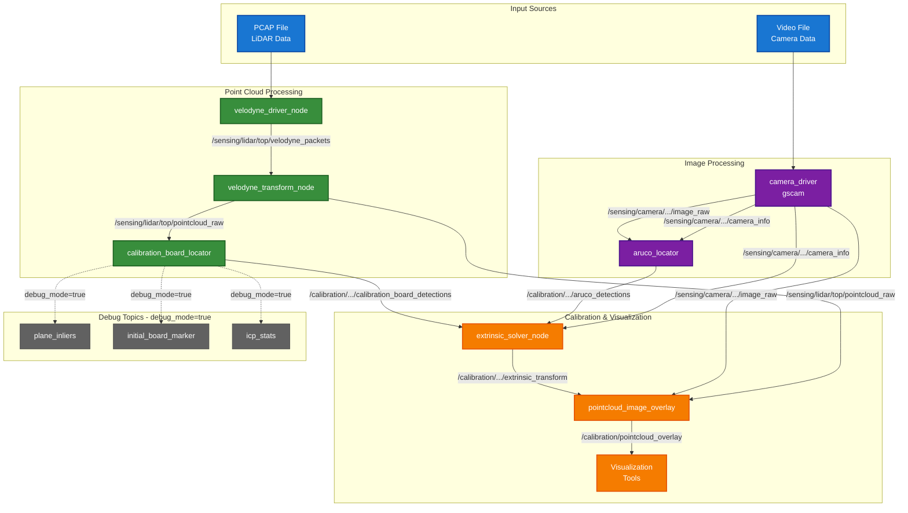

# LCTK - LiDAR Camera Toolkit

A comprehensive toolkit for calibrating LiDAR and camera systems, implemented in Rust with ROS 2 integration.

## Quick Start

```bash
# Clone the repository
git clone https://github.com/NEWSLabNTU/LCTK.git
cd LCTK

# Setup development environment
make setup                # Install system dependencies
make prepare              # Install ROS dependencies

# Build the project
make build

# Test with sample data
make launch_lidar_camera_sample_data    # Launch sample data playback
make launch_lidar_camera_calibration    # Launch calibration pipeline
```

## Overview

LCTK provides tools and ROS 2 nodes for:
- **LiDAR to Camera Calibration**: Compute extrinsic parameters between LiDAR and camera systems
- **LiDAR to LiDAR Calibration**: Align multiple LiDAR sensors
- **ArUco Marker Detection**: Detect and localize ArUco markers in camera images
- **Calibration Board Detection**: Detect hollow calibration boards in 3D point clouds
- **Real-time Visualization**: Live visualization of calibration results and sensor data

## System Architecture

The calibration pipeline consists of sensor processing, detection, and calibration stages:



## Installation

### Prerequisites
- Ubuntu 22.04 LTS
- Internet connection for dependency installation

### Setup Environment

```bash
# Setup system dependencies and development environment
make setup

# Install ROS package dependencies
make prepare
```

The setup process installs:
- ROS 2 Humble with required packages
- Rust toolchain (stable and nightly)
- OpenCV 4.5.4+ with development headers
- GStreamer with multimedia plugins
- Python 3.10+ with pip and development tools
- SFCGAL for geometric computations
- Build tools and system libraries

### Build Project

```bash
# Build entire project
make build

# Or build incrementally:
make build_ros2_rust     # Build ROS2 Rust base packages
make build_interface     # Build interface types
make build_packages      # Build LCTK nodes and tools
```

## Usage

LCTK supports two data input methods:
1. **Sample Data**: Pre-recorded test data included in the repository
2. **ROS Bag Playback**: Your own sensor recordings in ROS bag format

### Using Sample Data

Test the calibration pipeline with included sample data:

```bash
# Launch sample data playback (LiDAR + camera)
make launch_lidar_camera_sample_data

# Launch calibration pipeline
make launch_lidar_camera_calibration

# Launch with debug topics and RViz
make launch_lidar_camera_calibration debug_mode=true rviz=true

# Stop services when done
make stop_lidar_camera_calibration
make stop_lidar_camera_sample_data
```

### Using Your Own Data

For custom sensor data recorded in ROS bags:

```bash
# Play your rosbag in one terminal
ros2 bag play your_data.bag

# Launch calibration with rosbag-compatible QoS in another terminal
make launch_lidar_camera_calibration use_best_effort_qos=false

# With custom topic remapping if your bag uses different topic names
make launch_lidar_camera_calibration \
    use_best_effort_qos=false \
    lidar_topic:=/your/lidar/topic \
    camera_topic:=/your/camera/topic \
    camera_info_topic:=/your/camera_info/topic
```

Default expected topics:
- `/sensing/lidar/top/pointcloud_raw` (sensor_msgs/PointCloud2)
- `/sensing/camera/front_center/image_raw` (sensor_msgs/Image)
- `/sensing/camera/front_center/camera_info` (sensor_msgs/CameraInfo)

#### Two LiDAR Calibration

```bash
# Launch two LiDAR calibration pipeline
make launch_two_lidar_calibration

# This uses multi-wayside detection to align two LiDAR sensors
```

### Visualization

```bash
# Launch RViz for real-time visualization
make launch_rviz

# View debug topics in RViz when debug_mode=true:
# - /calibration/.../debug/plane_inliers
# - /calibration/.../debug/initial_board_marker
# - /calibration/.../debug/final_board_pose
# - /calibration/.../debug/icp_iterations
```

### Service Management

LCTK uses systemd services for reliable process management:

```bash
# Check status of all services
make service_status

# View logs from all services
make service_logs

# Clean up all services
make service_cleanup
```

## Customization

### Configuration Files

All calibration parameters and settings are stored in configuration files:

```bash
# Configuration file locations
src/ros2/lctk_launch/config/
├── board/              # Calibration board parameters
│   └── board_detector.json5    # ICP and RANSAC settings
├── aruco/              # ArUco marker patterns
│   └── aruco_5x5_*.yaml        # Marker definitions
└── camera/             # Camera calibration
    └── intrinsics.yaml         # Camera intrinsic parameters
```

To customize calibration parameters:
1. Edit the relevant JSON5 or YAML configuration file
2. Rebuild if you modified any Rust code (see below)
3. Restart the calibration pipeline

### Rebuilding After Code Changes

**Important**: If you modify any Rust or C/C++ source code, you must rebuild the project:

```bash
# After modifying Rust code in src/
make build
```

Configuration file changes (JSON5/YAML) do **not** require rebuilding - just restart the nodes.

## Troubleshooting

### Debug Logging

Enable detailed debug logging to diagnose calibration issues:

```bash
# Launch with debug logging enabled
RCUTILS_LOGGING_SEVERITY=DEBUG make launch_lidar_camera_calibration debug_mode=true

# View debug topics in another terminal
ros2 topic list | grep debug
ros2 topic echo /calibration/calibration_board_locator/debug/icp_stats
```

Debug mode provides:
- Detailed algorithm logs (RANSAC, ICP convergence)
- Additional visualization topics for RViz
- Performance metrics and statistics

### Common Issues

1. **Build fails with missing headers**
   ```bash
   sudo apt install libstdc++-12-dev libclang-dev
   ```

2. **Video playback issues with gscam**

   If sample data playback fails, test the GStreamer pipeline:
   ```bash
   # Check the gscam configuration
   cat src/ros2/lctk_launch/launch/camera.launch.xml

   # Test the GStreamer pipeline manually
   gst-launch-1.0 filesrc location=data/sampledata/3/video.avi ! \
       decodebin ! videoconvert ! autovideosink

   # Install missing plugins if needed
   sudo apt install gstreamer1.0-plugins-bad \
       gstreamer1.0-plugins-ugly gstreamer1.0-libav
   ```

3. **ROS dependency issues**
   ```bash
   make prepare  # Reinstall ROS dependencies
   ```

4. **Service management issues**
   ```bash
   make service_cleanup  # Clean up any stuck services
   ```

5. **No detections found**
   - Verify calibration board is visible in sensor data
   - Check configuration files in `src/ros2/lctk_launch/config/`
   - Enable debug mode to see intermediate processing steps
   - Ensure ArUco markers are clearly visible to camera

## Contributing

Please read [CONTRIBUTING.md](CONTRIBUTING.md) for development guidelines, code structure, and contribution process.

## License

This project is licensed under the MIT License - see the [LICENSE](LICENSE) file for details.

## Authors

This software is created and maintained by NEWSLAB, National Taiwan University.

- Lin Hsiang-Jui (2022-)
- philly12399 (2022-2023)
