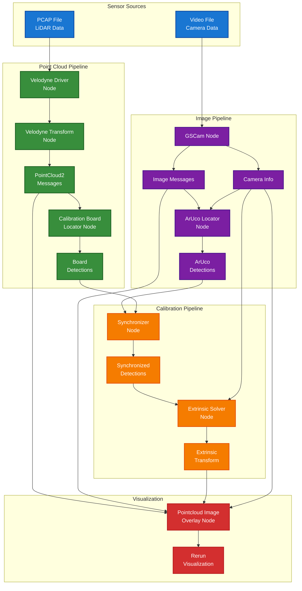
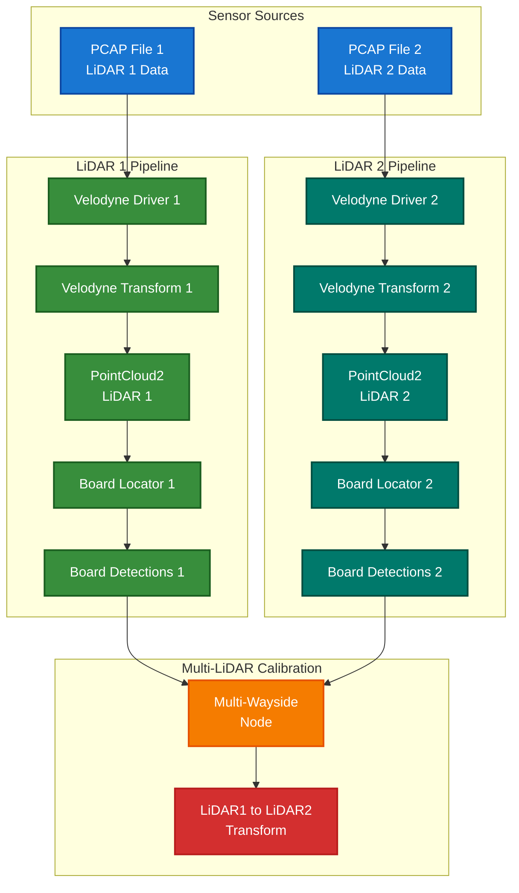

# LCTK - LiDAR Camera Toolkit

A comprehensive toolkit for calibrating LiDAR and camera systems, implemented in Rust with ROS 2 integration.

## Quick Start

```bash
# Clone and setup
git clone https://github.com/your-org/LCTK.git
cd LCTK
./setup-dev-env.sh -y    # Install all dependencies (~15-30 minutes)

# Build
source /opt/ros/humble/setup.bash
make build

# Test with sample data
make launch_sensor       # Launch sensor data playback
```

## Overview

LCTK provides tools and ROS 2 nodes for:
- LiDAR to camera extrinsic calibration
- LiDAR to LiDAR extrinsic calibration
- ArUco marker detection in images
- Calibration board detection in point clouds
- Real-time sensor data synchronization and visualization

## System Architecture

### LiDAR-Camera Calibration Pipeline

The following diagram shows the data flow for LiDAR-Camera calibration:



### Two LiDAR Calibration Pipeline

The following diagram shows the data flow for calibrating two LiDARs:



## Prerequisites

### System Requirements
- Ubuntu 22.04 LTS
- ROS 2 Humble
- Internet connection for downloading packages

## Installation

### Quick Setup (Recommended)

Use the automated setup script to install all dependencies:

```bash
# Clone the repository
git clone https://github.com/your-org/LCTK.git
cd LCTK

# Run the setup script (interactive mode - recommended for first-time setup)
./setup-dev-env.sh

# Or run non-interactively with defaults
./setup-dev-env.sh -y

# For minimal installation (no CUDA or dev tools)
./setup-dev-env.sh -y --minimal

# For verbose output (useful for debugging)
./setup-dev-env.sh -v

# See all available options
./setup-dev-env.sh --help
```

The setup script will automatically install:
- ROS 2 Humble and required packages
- Rust toolchain (stable and nightly)
- Python 3.10+ with pip and Poetry
- OpenCV 4.5.4+
- GStreamer with all necessary plugins
- SFCGAL for geometric computations
- libpcap for network packet capture
- Build tools and development dependencies

### Manual Installation

If you prefer to install dependencies manually, see the Ansible roles in `ansible/roles/` for the complete list of packages, or run:

```bash
# Install Ansible first
python3 -m pip install --user pipx
pipx install ansible==6.*

# Run the Ansible playbook directly
cd ansible/
ansible-galaxy collection install -f -r ansible-galaxy-requirements.yaml
ansible-playbook playbooks/lctk.dev_env.yaml
```

## Building

After running the setup script, build the project:

```bash
# Source ROS 2 environment
source /opt/ros/humble/setup.bash

# Build everything
make build

# Or build individual components:
make build_ros2_rust    # Build ROS 2 Rust base packages
make build_interface    # Build interface packages
make build_packages     # Build LCTK nodes and tools
```

## Usage

### LiDAR-Camera Calibration

1. **Prepare your data:**
   - PCAP file from Velodyne LiDAR
   - Video file from camera (AVI, MP4, etc.)
   - Configuration files for ArUco markers and calibration board

2. **Create configuration files:**
```bash
# Example ArUco pattern configuration (configs/aruco_pattern.json5)
{
  "dictionary": "DICT_5X5_100",
  "marker_size": 0.178,  // meters
  "marker_ids": [0, 1, 2, 3],
  "board_layout": {
    "rows": 2,
    "cols": 2,
    "spacing": 0.05  // meters
  }
}

# Example board configuration (configs/board_pattern.json5)
{
  "board_shape": {
    "board_width": "1m",
    "hole_radius": "0.15m",
    "hole_center_shift": "0.2m"
  },
  "marker_paper_size": {
    "meters": 0.5
  },
  "max_icp_iterations": 50
}
```

3. **Run the calibration:**
```bash
# Using the Makefile recipe
make launch_lidar_camera_calibration

# Or manually with custom parameters
ros2 launch calib_launch lidar_camera_calibration.launch.xml \
    pcap_file:=/path/to/your/lidar.pcap \
    video_file:=/path/to/your/video.avi \
    aruco_config_file:=/path/to/aruco_config.json5 \
    board_config_file:=/path/to/board_config.json5
```

### Two LiDAR Calibration

For calibrating two LiDARs:
```bash
# Using the Makefile recipe
make launch_two_lidar_calibration

# Or manually
ros2 launch calib_launch two_lidar_calibration.launch.xml \
    lidar1_pcap_file:=/path/to/lidar1.pcap \
    lidar2_pcap_file:=/path/to/lidar2.pcap \
    board_config_file:=/path/to/board_config.json5
```

### Sensor Data Playback Only

To just play back sensor data without running calibration:
```bash
make launch_sensor

# Or manually
ros2 launch calib_launch sensor.launch.xml \
    pcap_file:=/path/to/lidar.pcap \
    video_file:=/path/to/video.avi \
    loop:=true  # Loop playback
```

## Available ROS 2 Nodes

### Sensor Nodes
- **velodyne_driver_node**: Reads PCAP files and publishes raw Velodyne packets
- **velodyne_transform_node**: Converts raw packets to PointCloud2 messages
- **gscam_node**: Streams video files as ROS Image messages

### Processing Nodes
- **aruco_locator_node**: Detects ArUco markers in camera images
  - Subscribes: `/camera/image_raw`, `/camera/camera_info`
  - Publishes: `/aruco_detections`

- **calibration_board_locator**: Detects calibration boards in point clouds
  - Subscribes: `/velodyne_points`
  - Publishes: `/board_detections`

### Calibration Nodes
- **synchronizer**: Synchronizes detections from different sensors
  - Subscribes: `/aruco_detections`, `/board_detections`
  - Publishes: `/synchronized_detections`

- **extrinsic_solver**: Computes extrinsic calibration parameters
  - Subscribes: `/synchronized_detections`, `/camera/camera_info`
  - Publishes: `/extrinsic_transform`

- **multi_wayside_node**: Computes transform between two LiDARs
  - Subscribes: `/lidar1/board_detections`, `/lidar2/board_detections`
  - Publishes: `/lidar1_to_lidar2_transform`

### Visualization
- **pointcloud_image_overlay**: Projects point clouds onto camera images
  - Subscribes: `/velodyne_points`, `/camera/image_raw`, `/extrinsic_transform`
  - Outputs: Rerun visualization

## Topics

### Standard Topics
- `/velodyne_points` (sensor_msgs/PointCloud2): LiDAR point cloud data
- `/camera/image_raw` (sensor_msgs/Image): Camera image stream
- `/camera/camera_info` (sensor_msgs/CameraInfo): Camera calibration info

### Detection Topics
- `/calibration/aruco_locator/aruco_detections` (vision_msgs/Detection2DArray): Detected ArUco markers
- `/calibration/calibration_board_locator/board_detections` (vision_msgs/Detection3DArray): Detected calibration boards

### Calibration Topics
- `/calibration/synchronizer/synchronized_detections`: Time-synchronized detection pairs
- `/calibration/extrinsic_solver/extrinsic_transform` (geometry_msgs/TransformStamped): Computed extrinsic calibration

## Configuration Files

### Launch Parameters

Key parameters that can be configured:
- `pcap_file`: Path to Velodyne PCAP file
- `video_file`: Path to camera video file
- `aruco_config_file`: ArUco pattern configuration
- `board_config_file`: Calibration board configuration
- `debug_mode`: Enable debug logging
- `enable_visualization`: Enable Rerun visualization
- `sync_window_ms`: Time synchronization window (default: 50ms)

## Project Structure

### Libraries

- **[aruco-config](src/lib/aruco-config/README.md)** - Serializable types to describe ArUco patterns
- **[aruco-detector](src/lib/aruco-detector/README.md)** - ArUco board detector
- **[board-fitter](src/lib/board-fitter/README.md)** - Calibration board fitting algorithms
- **[hollow-board-config](src/lib/hollow-board-config/README.md)** - Serializable types to describe hollow-board shapes
- **[hollow-board-detector](src/lib/hollow-board-detector/README.md)** - Locate a hollow-board inside a point cloud
- **[multi-stream-synchronizer](src/lib/multi-stream-synchronizer/README.md)** - Time synchronization for multiple sensor streams
- **[plane-estimator](src/lib/plane-estimator/README.md)** - Fit a plane against a point cloud
- **[pnp-solver](src/lib/pnp-solver/README.md)** - A Rust wrapper around OpenCV `solve_pnp`
- **[serde-types](src/lib/serde-types/README.md)** - Common serializable types used across the project

### Standalone Programs

- **[aruco-generator](src/bin/aruco_generator/README.md)** - Generate ArUco board images
- **[find-aruco-marker](src/bin/find_aruco_marker/README.md)** - Detect ArUco markers in images
- **[find-hollow-board](src/bin/find_hollow_board/README.md)** - Detect hollow boards in point clouds
- **[pcd-tool](src/bin/pcd_tool/README.md)** - Convert and process point cloud data
- **[project-to-image](src/bin/project_to_image/README.md)** - Project 3D points to camera images
- **[extrinsic_solver](src/bin/extrinsic_solver/README.md)** - Solve extrinsic parameters between sensors

### ROS 2 Nodes

- **[aruco_locator_node](src/bin/aruco_locator_node/README.md)** - ROS 2 node for ArUco detection
- **[calibration_board_locator](src/bin/calibration_board_locator/README.md)** - ROS 2 node for board detection in point clouds
- **[synchronizer](src/bin/synchronizer/README.md)** - ROS 2 node for time synchronization
- **[extrinsic_solver](src/bin/extrinsic_solver/README.md)** - ROS 2 node for extrinsic calibration
- **[multi_wayside_node](src/bin/multi_wayside_node/README.md)** - ROS 2 node for multi-LiDAR calibration
- **[pointcloud_image_overlay](src/bin/pointcloud_image_overlay/README.md)** - ROS 2 node for visualization

### Launch Files

- **[calib_launch](src/bin/calib_launch/README.md)** - ROS 2 launch files for calibration pipelines

## Troubleshooting

### Common Issues

1. **gscam node crashes during video playback**
   - Install missing GStreamer plugins: `sudo apt install gstreamer1.0-plugins-bad gstreamer1.0-plugins-ugly gstreamer1.0-libav`

2. **OpenCV version 0.0.0 error during build**
   - The Makefile automatically sets the correct OpenCV environment variables
   - If issues persist, check that OpenCV is installed: `pkg-config --modversion opencv4`

3. **rosdep fails with "not initialized" error**
   - Run: `sudo rosdep init` followed by `rosdep update`
   - The setup script handles this automatically

4. **Build fails with missing SFCGAL**
   - Install SFCGAL: `sudo apt install libsfcgal-dev`
   - Or run the setup script which installs all dependencies

For more troubleshooting information, see [CLAUDE.md](CLAUDE.md).

## Contributing

Please read [CONTRIBUTING.md](CONTRIBUTING.md) for details on our code of conduct and the process for submitting pull requests.

## License

This project is licensed under the MIT License - see the [LICENSE](LICENSE) file for details.


## Authors

This software is created and maintained by NEWSLAB, National Taiwan
University. It was contributed by the following authors.

- Lin Hsiang-Jui (2022-)
- philly12399 (2022-2023)
