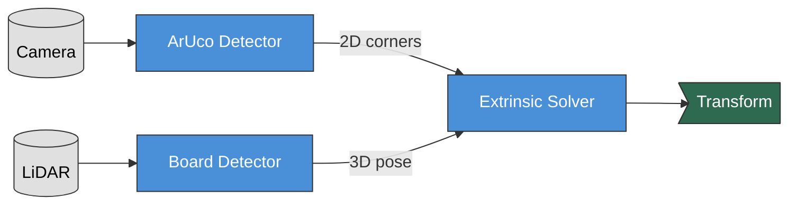

# LCTK Documentation

**LiDAR and Camera Toolkit** — Sensor calibration for robotics and autonomous systems.

## What is LCTK?

LCTK computes precise transformations between LiDAR and camera sensors by detecting a calibration board visible to both sensors. Use it to:

- **Fuse sensor data** — Project point clouds onto camera images
- **Calibrate multi-LiDAR setups** — Align multiple LiDAR sensors
- **Validate alignment** — Verify sensor installation and maintenance

## Quick Overview

The calibration pipeline detects a physical board from both sensors and computes the transformation that aligns their coordinate frames.

## Getting Started

1. **[Installation](./user-guide/installation.md)** — Set up LCTK on Ubuntu 22.04
2. **[Quick Start](./user-guide/quickstart.md)** — Run your first calibration in 5 minutes
3. **[LiDAR-Camera Calibration](./user-guide/lidar-camera.md)** — Full workflow guide

## Requirements

- **Ubuntu 22.04 LTS** with ROS 2 Humble
- **Calibration board**: 1m × 1m with 4 circular holes (150mm radius)
- **Sensors**: Velodyne LiDAR, camera with known intrinsics

## Documentation Structure

| Section | Description |
|---------|-------------|
| **User Guide** | Installation, calibration workflows, configuration |
| **Developer Guide** | Architecture, build system, contributing |

---

*LCTK is open source. See [Contributing](./developer-guide/contributing.md) to get involved.*
