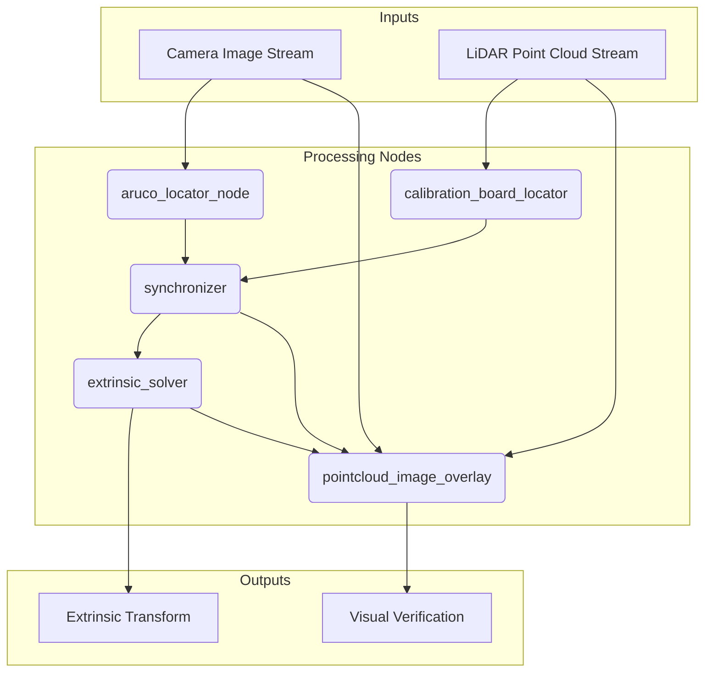

# Calibration Workflow

This document describes the complete workflow for performing LiDAR-camera calibration using LCTK.

## Overview

The calibration process is orchestrated by ROS 2 launch files that start and configure a series of nodes working together to perform the calibration. The workflow is designed to be modular and extensible.

## Workflow Diagram



## Step-by-Step Process

### 1. Data Input
The system accepts multiple input sources:
- **Live sensors**: Real-time camera and LiDAR data
- **Recorded data**: Video files (.avi, .mp4) and PCAP files (.pcap)
- **ROS bags**: Recorded ROS 2 message streams

### 2. Target Detection

#### ArUco Marker Detection
The `aruco_locator_node`:
- Subscribes to camera image streams
- Detects ArUco markers in each frame
- Publishes 2D detections with pixel coordinates
- Provides marker corner positions and IDs

#### Calibration Board Detection
The `calibration_board_locator`:
- Subscribes to LiDAR point cloud streams
- Detects hollow calibration boards
- Uses plane fitting and geometric matching
- Publishes 3D detections with board poses

### 3. Temporal Synchronization
The `synchronizer` node:
- Matches detections based on timestamps
- Handles sensor latency and timing differences
- Configurable synchronization tolerance
- Buffers data for real-time processing

### 4. Extrinsic Calibration
The `extrinsic_solver`:
- Uses corresponding 2D-3D point pairs
- Applies PnP algorithms (SQPNP, IPPE)
- Performs iterative refinement
- Computes 6-DOF transformation matrix

### 5. Validation and Visualization
Multiple visualization options:
- **Real-time overlay**: Point clouds projected onto images
- **RViz visualization**: 3D representation of calibration
- **Statistical metrics**: Reprojection errors and accuracy measures

## Running the Workflow

### Basic Usage
```bash
# Launch complete calibration pipeline
ros2 launch calib_launch lidar_camera_calibration.launch.xml \
    pcap_file:=/path/to/lidar.pcap \
    video_file:=/path/to/camera.avi \
    loop:=true
```

### With Custom Configuration
```bash
ros2 launch calib_launch lidar_camera_calibration.launch.xml \
    pcap_file:=/path/to/lidar.pcap \
    video_file:=/path/to/camera.avi \
    aruco_config_file:=/path/to/custom_aruco.json5 \
    board_config_file:=/path/to/custom_board.json5 \
    debug_mode:=true
```

### Monitoring Progress
```bash
# View detections in RViz
rviz2 -d config/aruco_detection.rviz

# Monitor topics
ros2 topic echo /calibration/aruco_locator/aruco_detections
ros2 topic echo /calibration/extrinsic_solver/extrinsic_transform

# Check detection statistics
ros2 topic hz /calibration/aruco_locator/aruco_detections
```

## Configuration Files

### ArUco Configuration
```json5
{
  "dictionary": "DICT_5X5_1000",
  "marker_size": 0.05,  // meters
  "markers": [
    {"id": 696, "position": [0.0, 0.0]},
    {"id": 64, "position": [0.1, 0.0]},
    {"id": 306, "position": [0.0, 0.1]},
    {"id": 195, "position": [0.1, 0.1]}
  ]
}
```

### Board Configuration
```json5
{
  "board_size": [0.6, 0.4],  // width, height in meters
  "hole_diameter": 0.05,     // meters
  "hole_positions": [
    [0.1, 0.1], [0.5, 0.1],
    [0.1, 0.3], [0.5, 0.3]
  ]
}
```

## Quality Control

### Detection Quality
- Minimum markers detected per frame
- Consistent marker IDs across frames
- Board detection success rate
- Geometric consistency checks

### Calibration Quality
- Reprojection error thresholds
- Transform stability over time
- Visual alignment verification
- Statistical outlier detection

## Troubleshooting

### Common Issues
1. **No detections**: Check lighting, target visibility, configuration files
2. **Poor accuracy**: Verify camera calibration, increase detection count
3. **Synchronization failures**: Adjust sync tolerance, check timestamps
4. **Visualization errors**: Verify TF tree, check coordinate frames