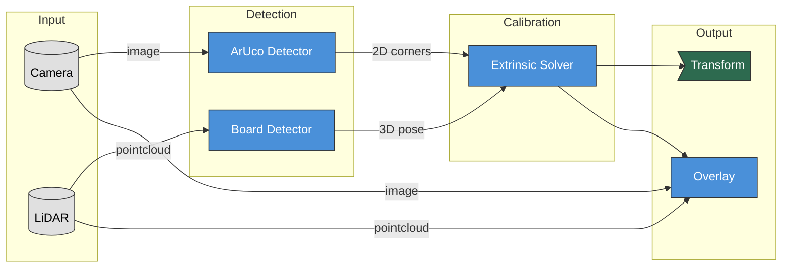

# Architecture

LCTK uses a layered architecture that separates algorithms from ROS 2 integration.

## Design Principles

### Separation of Concerns

```
┌─────────────────────────────────────────────────────┐
│              ROS 2 Nodes (ros/)                     │
│   Thin wrappers: topics, services, parameters       │
├─────────────────────────────────────────────────────┤
│            Core Libraries (rust/)                   │
│   Pure Rust: algorithms, no ROS dependencies        │
└─────────────────────────────────────────────────────┘
```

**Core libraries** (`rust/`) contain detection and calibration algorithms. They are pure Rust with no ROS dependencies, testable with `cargo test`, and reusable outside ROS.

**ROS nodes** (`ros/`) are thin wrappers that handle communication (topics, services) and lifecycle. They delegate actual work to core libraries.

This separation enables:
- Fast iteration with `cargo test` (no ROS setup needed)
- Algorithm reuse in non-ROS contexts
- Clear boundaries for testing and maintenance

### Lock-Free Configuration

Nodes use `arc-swap` for runtime configuration updates without blocking callbacks:

```rust
// Service updates config atomically
config.store(Arc::new(new_config));

// Detection callback reads without locking
let current = config.load();
```

## LiDAR-Camera Calibration Pipeline



### Data Flow

1. **Camera** publishes images; **LiDAR** publishes point clouds
2. **ArUco Detector** finds marker corners in images (2D)
3. **Board Detector** finds calibration board pose in point clouds (3D)
4. **Extrinsic Solver** computes LiDAR-to-camera transform using 2D-3D correspondences
5. **Overlay** projects points onto images using the computed transform

### Board Detection Pipeline

The board detector uses a multi-stage approach:

```
Pointcloud → Bounding Box Filter → RANSAC Plane → PCA Initial Pose → ICP Refinement → Pose
```

1. **Bounding box** filters points to region of interest
2. **RANSAC** detects the dominant plane (calibration board surface)
3. **PCA** computes initial pose from plane inliers
4. **ICP** refines pose by matching model to observed points

## Configuration Flow

```
Config Files (JSON5)
        ↓
Launch Parameters (XML)
        ↓
ROS Parameters
        ↓
Runtime Services (dynamic updates)
```

Configuration files in `ros/lctk_launch/config/` define:
- **ArUco pattern**: Marker IDs, positions, dictionary
- **Board geometry**: Dimensions, hole specifications
- **Bounding box**: Region of interest for detection

Launch files pass these to nodes as parameters. Some parameters (like bounding box) can be updated at runtime via services.

## Debug Mode

When `debug_mode=true`, nodes publish intermediate results for visualization:

- Filtered point clouds at each pipeline stage
- RANSAC plane visualization
- ICP iteration poses
- Detection statistics

Use RViz or the web UI to visualize these topics during development.

## Project Structure

```
LCTK/
├── rust/                    # Core libraries (pure Rust)
│   ├── aruco-detector/
│   ├── hollow-board-detector/
│   ├── plane-estimator/
│   └── ...
├── ros/                     # ROS 2 packages
│   ├── aruco_locator_node/
│   ├── lidar_board_detector/
│   ├── extrinsic_solver_node/
│   ├── lctk_launch/         # Launch files and configs
│   └── ...
├── book/                    # This documentation
└── justfile                 # Build commands
```

Explore the source code for implementation details. Each library and node has its own README and rustdoc comments.

## Extending LCTK

### Adding a New Detection Target

1. Implement detector algorithm in `rust/`
2. Create ROS node wrapper in `ros/`
3. Add configuration files and launch integration
4. Update extrinsic solver to accept new detection type

### Adding a New Solver Algorithm

1. Add algorithm to the solver library
2. Expose as a configuration option
3. Update node parameters

## Next Steps

- [Build System](./build-system.md) - How to build the project
- [Testing](./testing.md) - Testing strategies
- [Contributing](./contributing.md) - Development workflow
