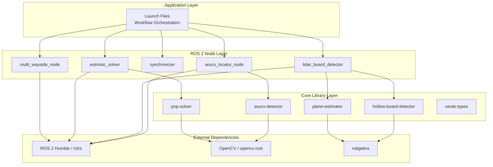

# Architecture Overview

LCTK is built on a layered architecture that separates algorithm implementations from ROS 2 integration, enabling code reuse and testability.

## System Layers



## Design Principles

### 1. Separation of Concerns

**Core Libraries** (`src/lib/`)
- Pure Rust, no ROS dependencies
- Testable with standard Rust tooling (`cargo test`)
- Reusable in non-ROS contexts
- Examples: `aruco-detector`, `hollow-board-detector`, `pnp-solver`

**ROS 2 Nodes** (`src/bin/`)
- Thin wrappers around core libraries
- Handle ROS communication (topics, services, parameters)
- Manage node lifecycle
- Examples: `aruco_locator_node`, `lidar_board_detector`

### 2. Type-Driven Development

**Serializable Types** (`serde-types`)
- Shared data structures across libraries
- JSON5 serialization for config files
- Type-safe configuration parsing

**ROS Message Types** (`src/interface/`)
- Custom message definitions for calibration data
- Generated Rust bindings via rclrs

### 3. Modularity

Each library has a single responsibility:
- `aruco-detector`: ArUco marker detection in images
- `hollow-board-detector`: Calibration board detection in point clouds
- `plane-estimator`: RANSAC plane fitting algorithms
- `pnp-solver`: Perspective-n-Point problem solving

## Component Architecture

### Core Libraries

**aruco-detector** (`src/lib/aruco-detector/`)
- Wraps OpenCV ArUco detection
- Configurable via `aruco-config` types
- Returns marker corners and IDs

**hollow-board-detector** (`src/lib/hollow-board-detector/`)
- Multi-stage pipeline: bounding box → RANSAC → ICP
- Uses `plane-estimator` for initial plane detection
- PCA-based pose initialization
- Iterative refinement with ICP

**pnp-solver** (`src/lib/pnp-solver/`)
- Solves camera pose from 2D-3D correspondences
- Supports multiple algorithms (SQPNP, IPPE, ITERATIVE)
- OpenCV wrapper with Rust-friendly API

**plane-estimator** (`src/lib/plane-estimator/`)
- RANSAC-based plane fitting
- Point cloud filtering and segmentation
- Robust outlier rejection

### ROS 2 Nodes

**Node Pattern:**
```rust
pub struct NodeState {
    // Core algorithm instance
    detector: ArUcoDetector,

    // ROS publishers
    detection_publisher: Publisher<Detection2DArray>,

    // Configuration
    config: Arc<ArcSwap<Config>>,
}
```

**Concurrency Model:**
- Lock-free updates using `arc-swap` for configuration
- Separate threads for detection and publishing
- Async ROS callbacks

## Communication Architecture

### Topic Flow (LiDAR-Camera)

```
Camera → aruco_locator_node → /aruco_detections
                                      ↓
                              synchronizer → /synchronized_detections
                                      ↑                    ↓
LiDAR → lidar_board_detector → /board_detections    extrinsic_solver
                                                           ↓
                                                 /calibration_transform
```

### Message Types

**Detection Messages:**
- `vision_msgs/Detection2DArray`: 2D ArUco marker detections
- `vision_msgs/Detection3DArray`: 3D board detections
- `geometry_msgs/TransformStamped`: Calibration results

**Custom Types:**
- Synchronization metadata
- Calibration quality metrics
- Debug visualization data

### Services

**Calibration Control:**
- `/trigger_calibration`: Start/stop calibration
- `/reset_calibration`: Clear buffered data

**Configuration:**
- `/set_roi_bounds`: Adjust detection region dynamically
- `/save_adjustments`: Persist manual corrections

## Build Architecture

### Three-Pass System

**Pass 1: ROS 2 Rust Foundation**
```
ros2_rust_ws/ → rclrs + ros2_interfaces
```

**Pass 2: Interface Types**
```
src/interface/ → Custom ROS message types for LCTK
```

**Pass 3: Applications**
```
src/lib/ (core libraries) + src/bin/ (ROS nodes)
```

**Why three passes?**
- `rclrs` generates bindings at build time
- Interface types depend on `rclrs`
- LCTK nodes depend on interface types
- Circular dependencies must be broken

## Configuration Architecture

**Hierarchy:**
1. **Default values**: Hardcoded in structs
2. **Config files**: JSON5 (board patterns, ArUco layouts)
3. **Launch parameters**: XML launch files
4. **Runtime parameters**: ROS parameter server
5. **Services**: Dynamic updates via services

**Config Propagation:**
```
Launch file → Node parameters → Core library config
                              → Runtime updates via services
```

## Data Flow Patterns

### Detection Pipeline

```
Sensor Data → Preprocessing → Detection → Validation → Publishing
```

### Calibration Pipeline

```
Multiple Detections → Buffering → Synchronization → Solving → Broadcasting
```

### Feedback Loop

```
Detection → Visualization → Manual Adjustment → Re-calibration
```

## Extension Points

### Adding New Calibration Targets

1. Implement detector in `src/lib/`
2. Create ROS node wrapper in `src/bin/`
3. Define custom messages in `src/interface/` (if needed)
4. Add launch file configuration

### Adding New PnP Solvers

1. Extend `pnp-solver` library with new algorithm
2. Update `extrinsic_solver_node` to expose algorithm choice
3. Add configuration parameter

### Adding New Sensors

1. Create sensor driver node (or use existing ROS drivers)
2. Implement detector for sensor-specific features
3. Add to synchronization pipeline

## Performance Considerations

**Real-time Processing:**
- Target: >10 Hz detection rate
- Minimize memory allocation in hot paths
- Use SIMD where applicable (via `nalgebra`)

**Memory Management:**
- Point cloud downsampling for large datasets
- Bounded queues for synchronization
- Zero-copy message passing where possible

**Scalability:**
- Stateless detection nodes (parallelizable)
- Distributed processing via ROS 2 multi-machine support

## Key Technologies

| Technology | Purpose | Version |
|------------|---------|---------|
| **Rust** | Core implementation | Stable channel |
| **ROS 2 Humble** | Middleware | Ubuntu 22.04 |
| **rclrs** | Rust ROS client | 0.5.x |
| **opencv-rust** | Computer vision | 0.92+ |
| **nalgebra** | Linear algebra | Latest |
| **small_gicp** | Point cloud ICP | Latest |

## Next Steps for Developers

- [Core Libraries](./libraries.md) - Detailed library documentation
- [ROS 2 Nodes](./ros2-nodes.md) - Node implementation patterns
- [Build System](./build-system.md) - Three-pass build details
- [Contributing](./contributing.md) - Development workflow
