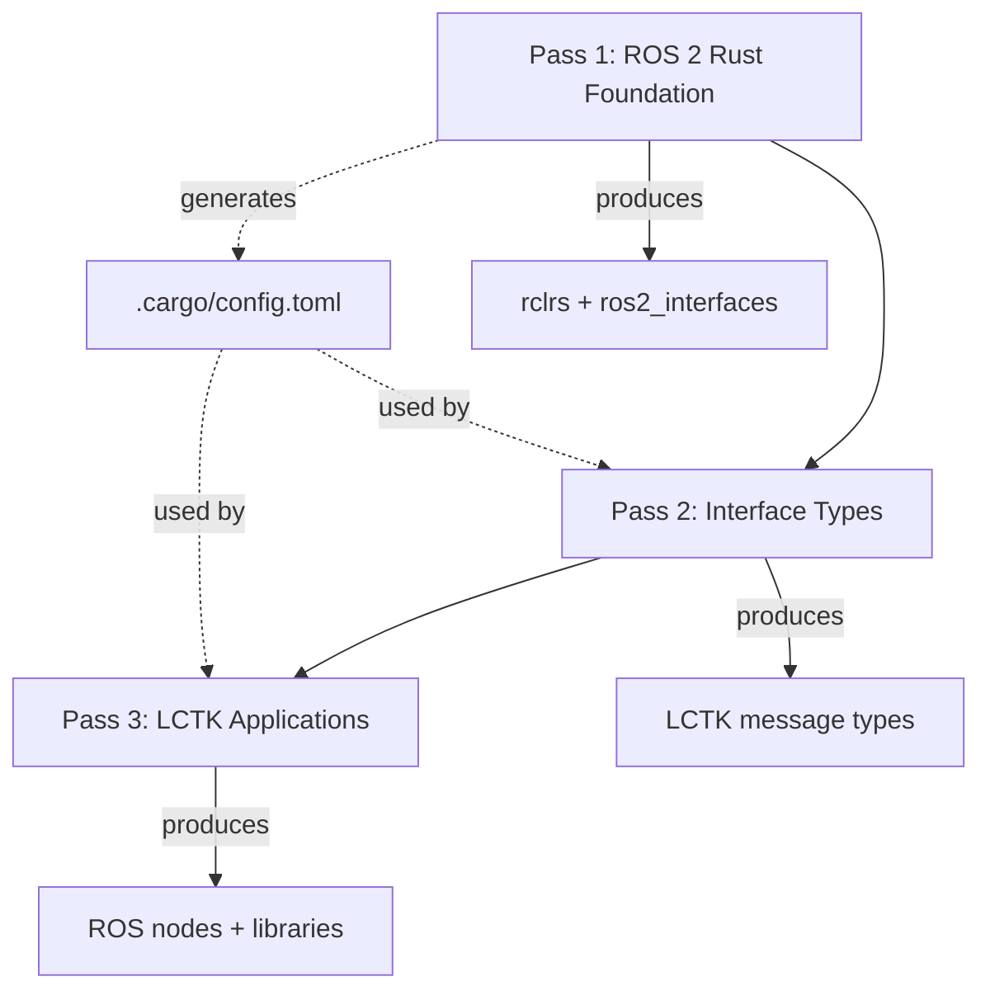

# Build System

LCTK uses a **three-pass build system** that handles complex dependency relationships between ROS 2, Rust, and LCTK packages.

## Three-Pass Architecture



## Why Three Passes?

**Problem:** Circular dependencies
- LCTK nodes need ROS message types
- Message types need `rclrs` bindings
- `rclrs` generates cargo config at build time
- Build system must break the cycle

**Solution:**
1. Build `rclrs` first (generates `.cargo/config.toml`)
2. Build LCTK interfaces (uses cargo config)
3. Build LCTK applications (uses interfaces)

## Pass 1: ROS 2 Rust Foundation

```bash
make build_ros2_rust
```

**Location:** `ros2_rust_ws/`

**Builds:**
- `rclrs` (ROS 2 client library for Rust)
- Standard ROS message types (`sensor_msgs`, `geometry_msgs`, etc.)
- ROS service types

**Critical output:** `.cargo/config.toml`
```toml
[patch.crates-io]
geometry_msgs = { path = "install/geometry_msgs/..." }
sensor_msgs = { path = "install/sensor_msgs/..." }
# ... more message packages
```

**⚠️ Important:** This config tells Cargo to use local ROS packages instead of crates.io.

## Pass 2: Interface Types

```bash
make build_interface
```

**Location:** `src/interface/`

**Builds:**
- LCTK-specific message types
- Custom service definitions
- Shared data structures

**Requires:** Pass 1 completion (needs cargo config)

**Example packages:**
- `lctk_msgs`: Custom calibration messages
- Detection synchronization types

## Pass 3: LCTK Applications

```bash
make build_packages
```

**Location:** `src/lib/`, `src/bin/`, `src/ros2/`

**Builds:**
- Core libraries (`src/lib/`)
- ROS 2 nodes (`src/bin/`, `src/ros2/`)
- Launch packages
- Configuration packages

**Requires:** Pass 1 & 2 completion

## Complete Build

```bash
# Build everything (all three passes)
make build

# Time: ~10 minutes first time, ~1-2 minutes incremental
```

## Incremental Development

### Rebuild Single Library

```bash
# Core library (no ROS)
cargo build --release --manifest-path src/lib/aruco-detector/Cargo.toml
```

### Rebuild Single ROS Node

**⚠️ Critical:** Always use `make build_packages`, not colcon directly!

```bash
# CORRECT: Preserves cargo config
make build_packages

# WRONG: May break .cargo/config.toml
colcon build --packages-select my_node
```

**Why?** `colcon build --packages-select` can corrupt the cargo configuration.

### Quick Test Build

```bash
# Syntax check (no code generation, fast)
cargo check

# Debug build (faster than release)
cargo build
```

## Build Configuration

### Makefile Variables

**Location:** `Makefile`

```makefile
COLCON_BUILD_FLAGS := --symlink-install \
                      --cmake-args -DCMAKE_BUILD_TYPE=Release \
                      --cargo-args --release

COLCON_TEST_FLAGS := --event-handlers console_direct+
```

**Key flags:**
- `--symlink-install`: Fast rebuilds (symlink instead of copy)
- `-DCMAKE_BUILD_TYPE=Release`: Optimized C++ builds
- `--release`: Optimized Rust builds

### Environment Variables

**OpenCV (required):**
```bash
export OPENCV_PKGCONFIG_NAME=opencv4
export OpenCV_DIR=/usr/lib/x86_64-linux-gnu/cmake/opencv4
```

**CUDA (optional):**
```bash
export CUDA_PATH=/usr/local/cuda
export CUDA_TOOLKIT_ROOT_DIR=/usr/local/cuda
```

**Build optimization:**
```bash
export CARGO_BUILD_JOBS=$(nproc)  # Parallel compilation
```

## Clean Builds

### Clean Everything

```bash
make clean
```

Removes: `build/`, `install/`, `log/`, `.cargo/`, `target/`

### Clean Specific Pass

```bash
# Clean Pass 1
make -C ros2_rust_ws clean

# Clean Pass 3 only
rm -rf build install log
```

### Selective Clean

```bash
# Remove single package
rm -rf build/<package_name> install/<package_name>

# Rebuild
make build_packages
```

## Common Build Issues

### Cargo Can't Find ROS Packages

**Error:** `error: failed to select a version for 'sensor_msgs'`

**Cause:** `.cargo/config.toml` missing or corrupted

**Fix:**
```bash
make build_ros2_rust  # Regenerate cargo config
make build_interface
make build_packages
```

### OpenCV Binding Failures

**Error:** `fatal error: 'memory' file not found`

**Fix:**
```bash
sudo apt-get install libstdc++-12-dev libclang-dev
export OPENCV_PKGCONFIG_NAME=opencv4
```

### SFCGAL Missing

**Error:** `SFCGAL/capi/sfcgal_c.h: No such file or directory`

**Fix (install):**
```bash
sudo apt-get install libsfcgal-dev
make build
```

**Fix (skip):**
```bash
# Exclude packages requiring SFCGAL
colcon build --packages-skip multi_wayside multi_wayside_node extrinsic_solver
```

## Build Performance

### Parallel Builds

```bash
# Use all CPU cores
export CARGO_BUILD_JOBS=$(nproc)

# Or limit (for memory-constrained systems)
export CARGO_BUILD_JOBS=4
```

### Incremental Compilation

```bash
# Enable for faster rebuilds (default in debug)
export CARGO_INCREMENTAL=1
```

### Caching

**Install sccache (shared compilation cache):**
```bash
cargo install sccache
export RUSTC_WRAPPER=sccache
```

**Benefits:** Reuse builds across projects

### Build Times

| Operation | First Time | Incremental |
|-----------|------------|-------------|
| Pass 1 (ROS Rust) | ~3 min | ~30 sec |
| Pass 2 (Interfaces) | ~1 min | ~10 sec |
| Pass 3 (LCTK) | ~6 min | ~1 min |
| **Total** | **~10 min** | **~2 min** |

*Times on 8-core CPU, 16GB RAM*

## Colcon Command Reference

```bash
# Build specific packages
colcon build --packages-select pkg1 pkg2

# Build with dependencies
colcon build --packages-up-to my_node

# Continue on error
colcon build --continue-on-error

# Build with verbose output
colcon build --event-handlers console_direct+

# Test specific package
colcon test --packages-select my_node
```

**⚠️ Order matters:** Always put `--packages-select` **before** `--cmake-args`:

```bash
# CORRECT
colcon build --packages-select my_node --cmake-args -DFOO=BAR

# WRONG (--packages-select treated as CMake arg)
colcon build --cmake-args -DFOO=BAR --packages-select my_node
```

## Development Workflow

### Standard Workflow

```bash
# 1. Make code changes
vim src/lib/my-detector/src/lib.rs

# 2. Test library locally
cargo test --manifest-path src/lib/my-detector/Cargo.toml

# 3. Rebuild ROS packages
make build_packages

# 4. Source workspace
source install/setup.bash

# 5. Run node
ros2 run my_node my_node
```

### Fast Iteration

```bash
# Edit library code
vim src/lib/aruco-detector/src/lib.rs

# Quick check (no build)
cargo clippy --manifest-path src/lib/aruco-detector/Cargo.toml

# Full test
cargo test --manifest-path src/lib/aruco-detector/Cargo.toml

# Only rebuild if tests pass
make build_packages
```

## IDE Integration

### VS Code

**Setup:**
```json
// .vscode/settings.json
{
  "rust-analyzer.cargo.allFeatures": true,
  "rust-analyzer.checkOnSave.command": "clippy",
  "rust-analyzer.linkedProjects": [
    "src/lib/aruco-detector/Cargo.toml",
    "src/bin/aruco_locator_node/Cargo.toml"
  ]
}
```

### CLion

**Setup:** Open project root, CLion auto-detects CMake + Cargo

## Troubleshooting

**Build hangs:**
```bash
# Kill stuck processes
pkill -9 colcon
pkill -9 cargo

# Clean and retry
make clean && make build
```

**Out of memory:**
```bash
# Reduce parallel jobs
export CARGO_BUILD_JOBS=2
make build
```

**Stale artifacts:**
```bash
# Nuclear option: delete everything
rm -rf build install log target .cargo ros2_rust_ws/{build,install,log}
make build
```

## Next Steps

- [Testing](./testing.md) - Testing strategies
- [Contributing](./contributing.md) - Development guidelines
- [Advanced Topics](./advanced-topics.md) - Build optimization
