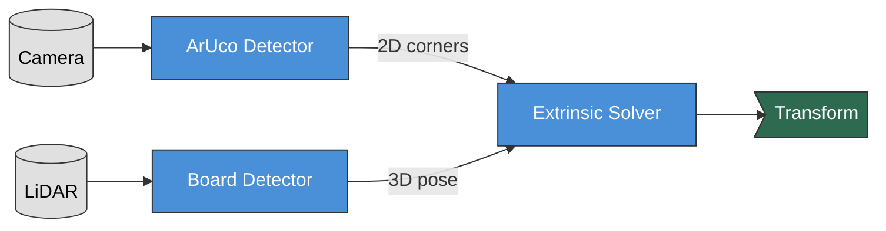

# LiDAR-Camera Calibration

This guide shows how to calibrate a LiDAR sensor with a camera, computing the transformation that allows you to project point clouds onto images.

## Workflow Overview



**What happens:**
1. **ArUco Detector** finds markers on the calibration board in camera images (2D corners)
2. **Board Detector** finds the hollow board pattern in point clouds (3D pose)
3. **Extrinsic Solver** computes the LiDAR-to-camera transformation using PnP algorithm

## Calibration Target

You need a **1m x 1m board** with:
- **3** circular holes (150mm radius), one omitted so the board's orientation
  is resolvable — see [the board model](../developer-guide/architecture.md#the-board-model-and-its-frame)
- ArUco markers (5x5 dictionary, IDs: 696, 64, 306, 195) printed on the board face

**Hang the board as a diamond**, standing on one corner. Every rig in this
repository does, the shipped detector configs assume it, and a board hung
square-on will not be detected without setting
`initial_inplane_rotation_deg` to its actual roll.

The board must be visible to both sensors simultaneously.

> **Known issue — this pipeline is currently untrustworthy.** The board
> detector publishes poses in the corner-aligned board frame, while the
> Python extrinsic solvers still build their marker geometry in the
> previous edge-aligned one. The resulting extrinsic is wrong by a 45°
> in-plane rotation, and that half of the error is *silent* — the
> reprojection error stays low. See
> `docs/issues/H-11-camera-solvers-stale-board-frame.md`. LiDAR-to-LiDAR
> calibration is unaffected.

## Step-by-Step Process

### 1. Prepare Your Data

Use the included sample data:
```bash
cd ~/repos/LCTK
just sample-data
```

Or record your own:
- **LiDAR**: PCAP file from Velodyne sensor
- **Camera**: Video file (MP4/AVI) or live stream

### 2. Launch Calibration

Run the demo (sample data + calibration):
```bash
just demo
```

Or run calibration separately with your own data:
```bash
just lidar-camera
```

### 3. Monitor Progress

Open `http://localhost:8000` to see the web UI.

Check detection rates (should be >1 Hz). Topics are namespaced `<lidar>_<marker>` / `<camera>` /
`<lidar>_<camera>` from your config's device and marker names; the sample-data config
(`config/examples/sample_data.yaml`) names them `top_lidar`, `calibration_board` and
`front_center`:
```bash
source install/setup.bash
ros2 topic hz /calibration/front_center/aruco_detections
ros2 topic hz /calibration/top_lidar_calibration_board/calibration_board_detections
```

View the calibration result:
```bash
ros2 topic echo /calibration/top_lidar_front_center/extrinsic_transform
```

### 4. Validate Results

The overlay visualization shows point clouds projected onto camera images. Check the `/calibration/pointcloud_overlay` topic to verify alignment.

If misaligned, check:
- Camera intrinsics file is correct
- Board geometry matches physical target
- Board is detected by both sensors

## Configuration

Key parameters in the marker's Detector Tuning preset, e.g.
`ros/lctk_launch/config/board/hollow_1000/velodyne.json5`:
- `plane_ransac_max_iterations`: RANSAC iterations (default: 2000)
- `plane_ransac_inlier_threshold`: Inlier distance in meters (default: 0.05)
- `max_icp_iterations`: ICP refinement iterations (default: 10)

Board geometry itself (plate size, cutout positions, marker layout) lives in the Target
Definition, e.g. `ros/lctk_launch/config/targets/hollow_1000_aruco_4_v1.json5`, not in the
Detector Tuning preset.

See [Configuration Guide](./configuration.md) for full details.

## Tips for Good Calibration

- **Placement**: Position board 3-5 meters from sensors
- **Coverage**: Move board to different positions for robustness
- **Lighting**: Ensure even lighting for ArUco detection
- **Stability**: Keep board stationary during data capture
- **Duration**: Record 30-60 seconds per position
