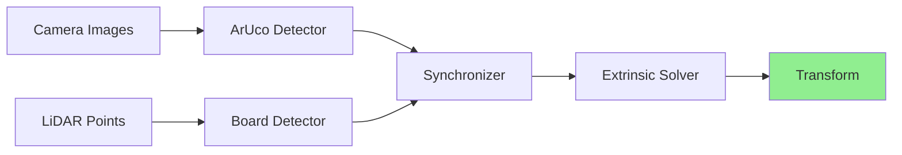

# LiDAR-Camera Calibration

This guide shows how to calibrate a LiDAR sensor with a camera, computing the transformation that allows you to project point clouds onto images.

## Workflow Overview



**What happens:**
1. **ArUco Detector** finds markers on the calibration board in camera images (2D positions)
2. **Board Detector** finds the hollow board pattern in point clouds (3D position and orientation)
3. **Synchronizer** matches detections from the same moment in time
4. **Extrinsic Solver** computes the camera-to-LiDAR transformation using PnP algorithm

## Calibration Target

You need a **1m × 1m board** with:
- 4 circular holes (150mm radius) arranged in corners
- ArUco markers (5x5 dictionary, IDs: 696, 64, 306, 195) printed on the board face

The board must be visible to both sensors simultaneously.

## Step-by-Step Process

### 1. Prepare Your Data

Record data with the board visible to both sensors:
```bash
# Option A: Use sample data
cd ~/repos/LCTK
make launch_lidar_camera_sample_data
```

Or record your own:
- **LiDAR**: PCAP file from Velodyne sensor
- **Camera**: Video file (MP4/AVI) or live stream

### 2. Launch Calibration

```bash
make launch_lidar_camera_calibration
```

Or with custom data:
```bash
ros2 launch lctk_launch lidar_camera_calibration.launch.xml \
    pcap_file:=/path/to/lidar.pcap \
    video_file:=/path/to/camera.mp4 \
    loop:=true
```

### 3. Monitor Progress

Check detection rates (should be >1 Hz):
```bash
ros2 topic hz /aruco_detections
ros2 topic hz /calibration_board_detections
```

View the calibration result:
```bash
ros2 topic echo /calibration_transform
```

### 4. Validate Results

Launch the point cloud overlay visualization:
```bash
ros2 run pointcloud_image_overlay pointcloud_image_overlay
```

You should see point clouds accurately overlaid on camera images. If misaligned, check:
- Camera intrinsics file is correct
- Board geometry matches physical target
- Sufficient detection pairs (>10 recommended)

## Configuration

Key parameters in `config/board/board_detector.json5`:
- `plane_ransac_max_iterations`: RANSAC iterations (default: 2000)
- `plane_ransac_inlier_threshold`: Inlier distance in meters (default: 0.05)
- `max_icp_iterations`: ICP refinement iterations (default: 10)

See [Configuration Guide](./configuration.md) for full details.

## Tips for Good Calibration

- **Placement**: Position board 3-5 meters from sensors
- **Coverage**: Move board to different positions for robustness
- **Lighting**: Ensure even lighting for ArUco detection
- **Stability**: Keep board stationary during data capture
- **Duration**: Record 30-60 seconds per position
