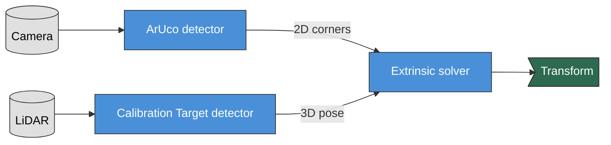

# LiDAR-Camera Calibration

This guide shows the current session-driven workflow for estimating the transform
between a LiDAR frame and a camera frame.

## Workflow


```mermaid
graph LR
    A[(Camera)] --> C[ArUco detector]
    B[(LiDAR)] --> D[Calibration Target detector]
    C -->|2D corners| F[Extrinsic solver]
    D -->|3D pose| F
    F --> G>Transform]

    classDef sensor fill:#e0e0e0,stroke:#333,color:#000
    classDef node fill:#4a90d9,stroke:#333,color:#fff
    classDef output fill:#2d6a4f,stroke:#333,color:#fff

    class A,B sensor
    class C,D,F node
    class G output
```

The camera detector supplies image-space fiducial corners. The LiDAR detector supplies
a pose for the same Calibration Target. The extrinsic solver uses synchronized
observations from both sensors.

## Calibration Target

The shipped `sample3-hollow-velodyne` session uses the hollow 1000 mm Target
Definition:

```
$(find-pkg-share lctk_launch)/config/targets/hollow_1000_aruco_4_v1.json5
```

Other sessions use other Target Definitions, including the solid 600 mm target. Do
not treat the hollow target, its dimensions, or its fiducial layout as universal
requirements. The physical target, its mounting, and the selected Target Definition
must agree.

The selected Detector Tuning preset supplies sensor-specific settings such as the
orientation reference and ICP parameters. The Target Definition supplies the physical
geometry and marker layout.

## Run the shipped example

The shipped session includes its pcap and camera recording:

```bash
source install/setup.bash
just check sample3-hollow-velodyne
just demo
```

`just demo` starts playback and calibration through `play_launch`. Its status page
is at <http://localhost:8000>; the justfile defaults to assisted solver mode, whose
review page is at <http://localhost:8080>.

The direct launch form starts the same session without `play_launch`:

```bash
ros2 launch lctk_launch session.launch.py \
    session:=$(ros2 pkg prefix lctk_launch --share)/sessions/sample3-hollow-velodyne
```

Direct launch defaults to continuous mode. It does not create the `:8000`
`play_launch` status page. Pass `solver_mode:=assisted` if you want the solver
review page.

For your own sensors or recording, scaffold a session and edit its manifest. See
[Calibration Sessions](./sessions.md).

## Inspect the graph

Topic names are derived from the session's device and marker names. In
`sample3-hollow-velodyne`, the relevant topics are:

```bash
source install/setup.bash

ros2 topic echo /calibration/top_front_center/extrinsic_transform
ros2 topic hz /calibration/front_center/aruco_detections
ros2 topic hz /calibration/top_calibration_board/calibration_board_detections
```

The `hz` commands report what the running graph is receiving; LCTK does not promise a
universal detection rate.

When direct launch is used, enable the overlay explicitly:

```bash
ros2 launch lctk_launch session.launch.py \
    session:=/path/to/session \
    enable_overlay:=true
```

The overlay is enabled by default by the `just` recipes. When enabled, inspect
`/calibration/pointcloud_overlay` and the camera image with projected LiDAR points.

## Detector tuning

The hollow-target Velodyne preset is:

```
$(find-pkg-share lctk_launch)/config/board/hollow_1000/velodyne.json5
```

Its current values include:

- `detection_mode: "bbox_free"`;
- `skip_ransac: true`, so the RANSAC iteration settings are not used by this preset;
- `sensor_up_axis: "z"`;
- `initial_inplane_rotation_deg: 0.0`;
- `max_icp_iterations: 100`.

Other presets have different values. For example, the bbox-mode Velodyne preset
requires a session-local `bbox_config`, and the Seyond presets use a different
sensor-up-axis convention. Change the preset only with the corresponding physical
sensor and Target Definition.

## Practical checks

- Ensure both sensors observe the same Calibration Target at overlapping times.
- Confirm the camera image and camera-info topics are available.
- Confirm the LiDAR topic and frame ID in the session manifest.
- Run `lctk_session check` before launching a bag-backed session.
- Capture distinct Board Placements when using manual or assisted multi-pose solving.
- Treat the resulting Quality Verdict as separate from whether the numerical solve
  returned an estimate.

For configuration details, see [Configuration](./configuration.md). For failures, see
[Troubleshooting](./troubleshooting.md).
