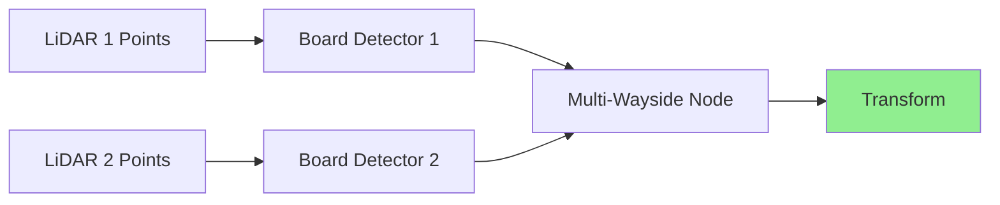

# Multi-LiDAR Calibration

This guide shows how to calibrate two or more LiDAR sensors, computing the transformation between their coordinate frames for point cloud fusion.

## Workflow Overview



**What happens:**
1. Both LiDARs see the **same calibration board** from different angles
2. Each **Board Detector** finds the board in its point cloud (3D pose)
3. **Multi-Wayside Node** synchronizes detections and computes the LiDAR-to-LiDAR transformation

**Key difference from LiDAR-camera:** No ArUco markers needed, only the hollow board pattern.

## Calibration Target

You need the same **1m × 1m hollow board**:
- 4 circular holes (150mm radius) in corners
- Board must be visible to **both LiDARs simultaneously**

## Step-by-Step Process

### 1. Prepare Your Data

Use the included sample data:
```bash
cd ~/repos/LCTK
make launch_two_lidar_calibration
```

This plays back data from two LiDARs that both see the calibration board.

Or record your own:
- Place board where both LiDARs can see it clearly
- Record PCAP files from both sensors simultaneously
- Keep board stationary for 30-60 seconds per position

### 2. Launch Calibration

The `launch_two_lidar_calibration` command starts:
- Two Velodyne driver nodes (playing PCAP data)
- Two board detector nodes (one per LiDAR)
- Multi-wayside node (computes transformation)

### 3. Monitor Progress

Check that both LiDARs are detecting the board:
```bash
# Should both show >1 Hz
ros2 topic hz /sensing/lidar/top/board_detections
ros2 topic hz /sensing/lidar/front/board_detections
```

View the calibration result:
```bash
ros2 topic echo /calibration_transform
```

### 4. Validate Results

Visualize in RViz:
```bash
rviz2
```

Add both point cloud topics:
- `/sensing/lidar/top/pointcloud_raw`
- `/sensing/lidar/front/pointcloud_raw`

Set Fixed Frame to `velodyne_top`. If calibrated correctly, point clouds from both sensors should align perfectly (e.g., walls, floors appear as single surfaces).

## Configuration

Key parameters in `config/multi_wayside.yaml`:
- `same_face_mode: true` — Both LiDARs see the **same side** of the board
- `sync_tolerance_ms: 100` — Maximum time difference between detections (100ms)
- `min_detections_for_calibration: 5` — Minimum synchronized pairs needed

If LiDARs see **opposite sides** of the board, set `same_face_mode: false` to apply 180° correction.

## Tips for Good Calibration

- **Placement**: Position board 3-8 meters from both LiDARs
- **Overlap**: Ensure both LiDARs have good view of the board
- **Multiple positions**: Move board to 3-5 different positions
- **Stability**: Keep board stationary during capture
- **Distance variation**: Include near (3m) and far (8m) positions

## Troubleshooting

**Only one LiDAR detecting:** Check bounding box configuration covers board location for both sensors

**Detections not synchronizing:** Increase `sync_tolerance_ms` or check that data streams have valid timestamps

**Transform seems flipped:** Toggle `same_face_mode` in configuration
