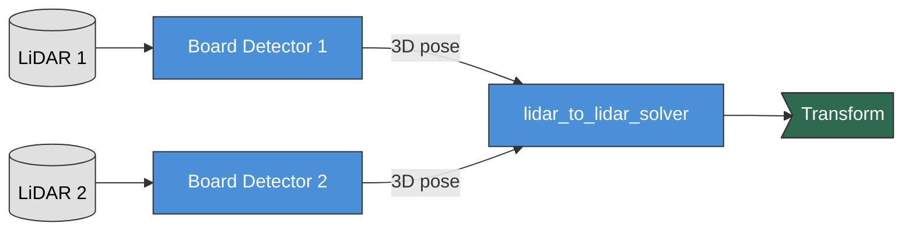

# Multi-LiDAR Calibration

This guide shows how to calibrate two or more LiDAR sensors, computing the transformation between their coordinate frames for point cloud fusion.

> **Note.** This page previously described a `multi_wayside_node` / `config/multi_wayside.yaml`
> workflow. That node and config file no longer exist — `multi_wayside.yaml` was deleted this
> phase (it dangled long before that) and `lidar_to_lidar_solver` is the maintained replacement,
> generated by config-driven launch. The steps and topic names below have been corrected against
> the current code, but per the repo root `CLAUDE.md`: "**Note: This pipeline is not yet
> tested.**" Treat this page as the current interface, not as a validated procedure — see
> `docs/issues/` for the current tracker entries on `lidar_to_lidar_solver` before relying on it.

## Workflow Overview



**What happens:**
1. Both LiDARs see the **same calibration board** from different angles
2. Each **Board Detector** (`lidar_board_detector`) finds the board in its point cloud (3D pose)
3. **`lidar_to_lidar_solver`** synchronizes both detection streams (via `lctk_sync`/Conflux) and
   computes the LiDAR-to-LiDAR transformation

**Key difference from LiDAR-camera:** No ArUco markers needed, only the hollow board pattern.

## Calibration Target

You need the same **1m x 1m hollow board**:
- **3** circular holes (150mm radius) — see
  [the board model](../developer-guide/architecture.md#the-board-model-and-its-frame)
- Hung as a **diamond**, standing on one corner
- Board must be visible to **both LiDARs simultaneously**

## Step-by-Step Process

### 1. Prepare Your Data

`just two-lidar` only starts the **calibration pipeline** (`calibrate.launch.py` with
`config/examples/two_lidar.yaml`) — it does not play back any sensor data itself. Play the
two-LiDAR data separately, in another terminal, before or alongside it:

```bash
# The recorded two-LiDAR bags are gitignored -- see ros/lctk_sample_data/bags/README.md
# to obtain them, then:
ros2 bag play ros/lctk_sample_data/bags/TWO_LIDAR_<name>
```

Or record your own:
- Place board where both LiDARs can see it clearly
- Record data from both sensors simultaneously (`ros2 bag record -a`)
- Keep board stationary for 30-60 seconds per position

`two_lidar.yaml` names its devices `top_lidar` (`/velodyne_points`, frame `velodyne`) and
`front_lidar` (`/iv_points`, frame `seyond`) — point your own recording at those topics, or edit
the config to match yours.

### 2. Launch Calibration

```bash
cd ~/repos/LCTK
just two-lidar
```

This generates, from `two_lidar.yaml`:
- Two `lidar_board_detector` nodes (one per LiDAR, each may use a different Detector Tuning
  preset — `two_lidar.yaml` gives `front_lidar` the Seyond-tuned preset)
- One `lidar_to_lidar_solver` node (synchronizes both streams and computes the transform)
- Zero `aruco_locator_node`s (no cameras)

### 3. Monitor Progress

Open `http://localhost:8000` to see the web UI.

Check that both LiDARs are detecting the board. Topics are namespaced `<lidar>_<marker>` from
the config's device and marker names — `two_lidar.yaml` names its marker `calibration_board`:
```bash
source install/setup.bash

# Should both show >1 Hz
ros2 topic hz /calibration/top_lidar_calibration_board/calibration_board_detections
ros2 topic hz /calibration/front_lidar_calibration_board/calibration_board_detections
```

View the calibration result (namespace is `<lidar1>_<lidar2>`):
```bash
ros2 topic echo /calibration/top_lidar_front_lidar/lidar_to_lidar_transform
```

### 4. Validate Results

If you have a display, visualize in RViz:
```bash
just rviz
```

Add both point cloud topics (from `two_lidar.yaml`'s `pointcloud_topic`s):
- `/velodyne_points` (`top_lidar`)
- `/iv_points` (`front_lidar`)

Set Fixed Frame to `velodyne` (`top_lidar`'s `frame_id` in `two_lidar.yaml`). If calibrated
correctly, point clouds from both sensors should align perfectly (e.g., walls, floors appear as
single surfaces).

## Configuration

`config/multi_wayside.yaml` does not exist any more (deleted this phase; it was already dangling
before that). `same_face_mode` (`true`: both LiDARs see the **same side** of the board; `false`:
apply a 180-degree correction for **opposite** sides) is a `lidar_to_lidar_solver` ROS parameter,
defaulting to `true`. Config-driven launch (`calibrate.launch.py`) does not currently expose it
through the calibration config's YAML schema, so to run with `same_face_mode: false` invoke the
node directly with `--ros-args -p same_face_mode:=false` instead of `just two-lidar`, or add the
parameter to the config-driven launch node args yourself.

There is no minimum-detections-before-solving gate in the current `lidar_to_lidar_solver` — unlike
`lidar_to_camera_solver`'s manual mode, it does not buffer poses; it solves each synchronized pair
as it arrives (see `ros/lidar_to_lidar_solver/lidar_to_lidar_solver/main.py`, which is also the
source of truth for every parameter above — the package has no README of its own yet).

The synchronizer window is configured the same way as LiDAR-camera: it lives in the calibration
config's required `sync:` section (e.g. `config/examples/two_lidar.yaml`'s `sync.tolerance_ms`) —
see "Synchronizer Parameters (Conflux)" in the top-level `CLAUDE.md`.

## Tips for Good Calibration

- **Placement**: Position board 3-8 meters from both LiDARs
- **Overlap**: Ensure both LiDARs have good view of the board
- **Multiple positions**: Move board to 3-5 different positions
- **Stability**: Keep board stationary during capture
- **Distance variation**: Include near (3m) and far (8m) positions

## Troubleshooting

**Only one LiDAR detecting:** Check bounding box configuration covers board location for both sensors

**Detections not synchronizing:** Increase `sync.tolerance_ms` in the calibration config's `sync:` section, or check that data streams have valid timestamps

**Transform seems flipped:** Toggle `same_face_mode` in configuration
