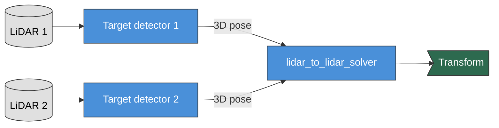

# Multi-LiDAR Calibration

This guide shows how to calibrate multiple LiDAR sensors using the maintained
config-driven `lidar_to_lidar_solver` pipeline.

## Workflow


```mermaid
graph LR
    A[(LiDAR 1)] --> C[Target detector 1]
    B[(LiDAR 2)] --> D[Target detector 2]
    C -->|3D pose| E[lidar_to_lidar_solver]
    D -->|3D pose| E
    E --> F>Transform]

    classDef sensor fill:#e0e0e0,stroke:#333,color:#000
    classDef node fill:#4a90d9,stroke:#333,color:#fff
    classDef output fill:#2d6a4f,stroke:#333,color:#fff

    class A,B sensor
    class C,D,E node
    class F output
```

Each LiDAR detects the same Calibration Target. The solver synchronizes the two
detection streams and publishes a LiDAR-to-LiDAR transform.

## Shipped session

The maintained example is:

```
sessions/twolidar-vlp32-falcon/session.yaml
```

It uses the hollow 1000 mm Target Definition and pairs `top_lidar` with
`front_lidar`. The recording is not committed to the repository. Obtain it
according to `ros/lctk_sample_data/bags/README.md`, then make it available at the
path declared by the session.

The manifest currently declares:

| device | topic | frame |
|---|---|---|
| `top_lidar` | `/lidar/vlp32/velodyne_points` | `velodyne` |
| `front_lidar` | `/lidar/falcon/iv_points` | `seyond` |

Run the session check before launching:

```bash
source install/setup.bash
just check twolidar-vlp32-falcon
```

## Run the calibration

When the bag is available at the session's declared path, `just run` starts both the
bag player and calibration graph:

```bash
just run twolidar-vlp32-falcon
```

This recipe uses `play_launch`, so its launch status page is at
<http://localhost:8000>. The LiDAR-to-LiDAR solver itself has no browser review page;
inspect its ROS output instead.

The direct form is:

```bash
ros2 launch lctk_launch session.launch.py \
    session:=$(ros2 pkg prefix lctk_launch --share)/sessions/twolidar-vlp32-falcon
```

If data is already being played, start only the calibration graph:

```bash
just calibrate /path/to/twolidar-vlp32-falcon/session.yaml
```

For a plain calibration YAML, play the recording separately and ensure its topics and
frames match the YAML.

## Inspect topics and output

The detection streams for the shipped session are:

```bash
source install/setup.bash
ros2 topic hz /calibration/top_lidar_calibration_board/calibration_board_detections
ros2 topic hz /calibration/front_lidar_calibration_board/calibration_board_detections
```

The solver output is:

```bash
ros2 topic echo /calibration/top_lidar_front_lidar/lidar_to_lidar_transform
```

LCTK does not promise a universal detection rate. A missing stream should first be
checked against the session manifest and the bag metadata.

For RViz, use the exact topics from the manifest:

- `/lidar/vlp32/velodyne_points`
- `/lidar/falcon/iv_points`

The shipped `twolidar-vlp32-falcon` session can provide its own RViz layout when one
is present. Otherwise pass an explicit `rviz_config:=...` or use `just rviz` for the
default calibration layout.

## Solver parameters

`same_face_mode` is a ROS parameter of `lidar_to_lidar_solver`; it is not a key in
the session YAML schema generated by the current launch planner. The generated node
plan supplies the topics, frames, remappings, and synchronization settings. Do not
recommend changing this parameter through the session manifest.

The required `sync:` section controls the synchronization window and queue policy:

```yaml
sync:
  tolerance_ms: 100
  queue_size: 100
  drop_policy: reject_new
```

The solver processes synchronized non-empty detection pairs as they arrive. It does not
use the LiDAR-camera manual capture buffer.

## Practical checks

- Both sensors must observe the same physical Calibration Target.
- The two detector presets must refer to the same Target Definition.
- Run `lctk_session check` before a bag-backed run.
- Confirm the two bag topics in `metadata.yaml` match the manifest.
- Use multiple distinct Board Placements when collecting data intended for a
  calibration estimate.
