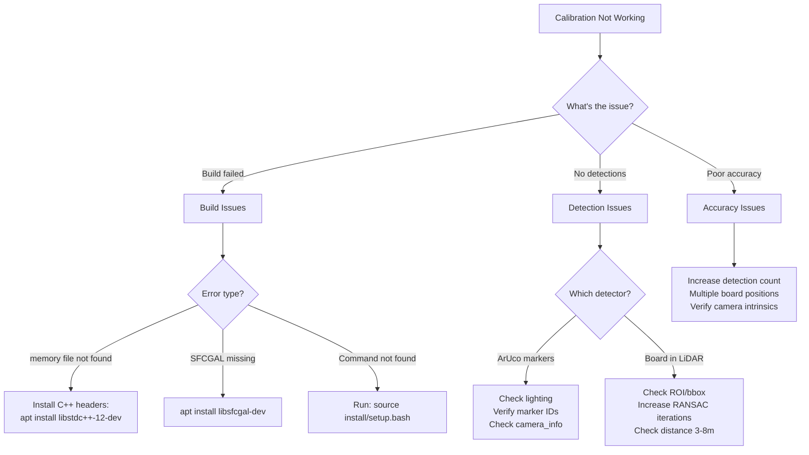

# Troubleshooting

Quick fixes for common LCTK issues.

## Diagnostic Flowchart



## Quick Fixes

### 1. Build Failures

**Error: `fatal error: 'memory' file not found`**
```bash
sudo apt-get install libstdc++-12-dev libclang-dev
```

**Error: `SFCGAL not found`**
```bash
sudo apt-get install libsfcgal-dev
```

**Error: `command not found` after build**
```bash
source install/setup.bash
```

**Error: ROS 2 daemon unresponsive**
```bash
pkill -9 -f ros2-daemon
```

### 2. No Detections

#### ArUco Markers Not Detected

**Check if images are arriving:**
```bash
ros2 topic hz /sensing/camera/front_center/image_raw
```

**Common fixes:**
- Improve lighting (avoid glare and shadows)
- Verify marker IDs match config file (`aruco_pattern.json5`)
- Check camera_info is valid (not all zeros)
- Clean marker surfaces
- Ensure markers are flat and undistorted

#### Board Not Detected in Point Cloud

**Check if point clouds are arriving:**
```bash
ros2 topic hz /sensing/lidar/top/pointcloud_raw
```

**Common fixes:**
1. **Adjust bounding box** in `config/board/bbox.json5`:
   ```json5
   {
     "center": [3.0, 0.0, 0.0],  // Board 3m in front
     "size": [6.0, 6.0, 3.0]     // Large search area
   }
   ```

2. **Increase RANSAC iterations** in `board_detector.json5`:
   ```json5
   "plane_ransac_max_iterations": 5000  // From default 2000
   ```

3. **Check board distance:** Works best at 3-8 meters

4. **Visualize in RViz:**
   ```bash
   rviz2
   # Add PointCloud2 topic, check if board is visible
   ```

5. **Check the board's mounting and the pose seed.** The detector seeds ICP
   from a diamond-mounted board (standing on one corner) and the sensor's up
   axis. If the plate arrives but ICP never converges — no detections, no
   error — the seed is the usual cause:
   - `sensor_up_axis` must name the sensor's own up axis (`"z"` for
     Velodyne, `"x"` for the Seyond Falcon).
   - `initial_inplane_rotation_deg` must be `0.0` for a diamond-mounted
     board, which is every rig here. A 45° error is exactly the worst case:
     it sits halfway between two of the square's symmetric orientations, so
     ICP has no gradient to follow and silently finds nothing. Do not sweep
     this parameter; see
     [Configuration](./configuration.md#sensor_up_axis-and-initial_inplane_rotation_deg).

### 3. Poor Calibration Accuracy

**Symptoms:** Misaligned point clouds on images, high reprojection error

**Solutions:**
1. **Collect more data:**
   - Record 3-5 different board positions
   - Include various distances (3m, 5m, 8m)
   - Cover different angles

2. **Check camera intrinsics:**
   ```bash
   # Verify camera_info.yaml has correct values
   # Re-calibrate camera if needed
   ```

3. **Verify board geometry:**
   - Measure physical board dimensions
   - Update `board_detector.json5` if dimensions changed
   - Check hole positions and diameters

### 4. Performance Issues

**Slow detection (>2 seconds per frame):**
```bash
# Reduce ICP iterations in board_detector.json5
"max_icp_iterations": 5  # From default 10

# Check CPU usage
htop
```

**High memory usage:**
```bash
# Monitor memory
free -h

# Restart nodes if memory leak suspected
```

### 5. Visualization Issues

**RViz not showing topics:**
```bash
# Check ROS domain
echo $ROS_DOMAIN_ID

# Restart RViz
pkill rviz2 && rviz2
```

**Overlay images wrong:**
- Known issue with 45° tilt (see CLAUDE.md)
- Verify extrinsic transform is being published
- Check TF tree: `ros2 run tf2_tools view_frames`

## Debugging Tools

### Check Detection Rates

```bash
# Should all be >1 Hz for successful calibration
ros2 topic hz /aruco_detections
ros2 topic hz /calibration_board_detections
ros2 topic hz /calibration_transform
```

### Enable Debug Mode

```bash
ros2 launch lctk_launch lidar_camera_calibration.launch.xml debug_mode:=true
```

Debug topics show intermediate steps:
- `/calibration/debug/filtered_points`
- `/calibration/debug/plane_inliers`
- `/calibration/debug/initial_board_marker`
- `/calibration/debug/final_board_pose`

### View Logs

```bash
# ROS 2 logs
tail -f ~/.ros/log/latest/<node>-*.log

# Or increase log level
export RCUTILS_CONSOLE_OUTPUT_FORMAT="[{severity}] [{name}]: {message}"
export RCUTILS_LOGGING_LEVEL=DEBUG
```

## Getting Help

If issues persist:

1. **Check configuration files** match your physical setup
2. **Try sample data first** to isolate hardware issues
3. **Review CLAUDE.md** for known issues
4. **Report bugs** at GitHub issues with:
   - Error messages
   - Configuration files
   - Output of `ros2 topic list` and `ros2 node list`

## Common Pitfalls

- **Wrong working directory:** Always run from project root (`/home/aeon/repos/LCTK`)
- **Forgot to source:** Run `source install/setup.bash` after every build
- **Config file paths:** Use absolute paths or ensure CWD is correct
- **Board visibility:** Both sensors must see board **simultaneously**
- **Static board:** Board must be stationary during data capture
