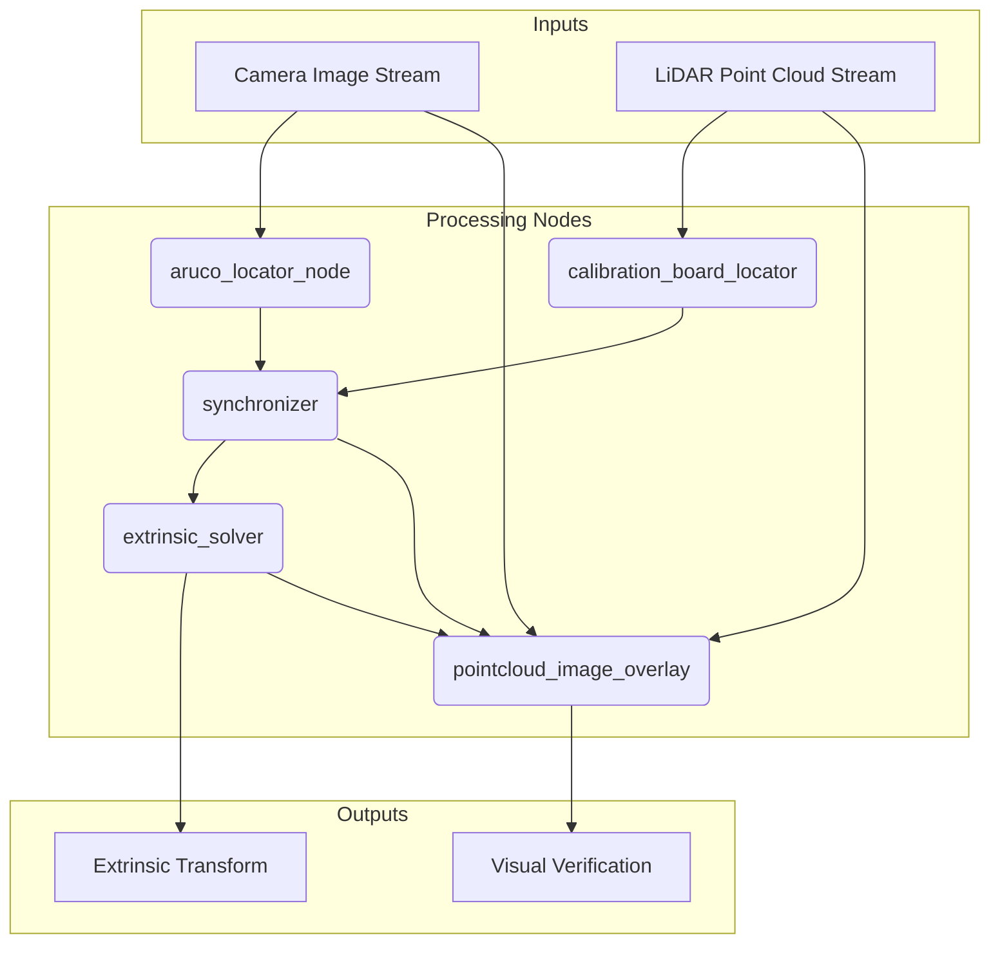

# Calibration Workflow

This document describes the main LiDAR-to-camera calibration workflow in the LCTK project.

"""## Overview

The calibration process is orchestrated by the `calibration_pipeline.launch.yaml` launch file, located in `src/bin/calib_launch/launch`. This launch file starts and configures a series of ROS 2 nodes that work together to perform the calibration.

## Workflow Diagram



The workflow can be summarized as follows:""

1.  **Data Input**: The system takes two main inputs:
    *   A camera image stream (e.g., from a video file or a live camera).
    *   A LiDAR point cloud stream (e.g., from a pcap file or a live LiDAR).

2.  **Marker Detection**:
    *   The `aruco_locator_node` subscribes to the camera image stream and detects ArUco markers in each image. The results are published as `vision_msgs/Detection2DArray` messages.

3.  **Board Detection**:
    *   The `calibration_board_locator` node subscribes to the point cloud stream and detects the calibration board. The results are published as `vision_msgs/Detection3DArray` messages.

4.  **Synchronization**:
    *   The `synchronizer` node subscribes to the outputs of the `aruco_locator_node` and the `calibration_board_locator`. It synchronizes the detections based on their timestamps, ensuring that the marker and board detections correspond to the same point in time.

5.  **Extrinsic Calibration**:
    *   The `extrinsic_solver` node subscribes to the synchronized detections from the `synchronizer`. It uses the 2D marker detections and the 3D board detections to solve for the extrinsic calibration between the LiDAR and the camera. The resulting transformation is published as a `geometry_msgs/TransformStamped` message.

6.  **Visualization**:
    *   The `pointcloud_image_overlay` node subscribes to the original image and point cloud streams, as well as the calculated extrinsic transform. It projects the point cloud onto the image and publishes the result, allowing for visual verification of the calibration.

## Running the Workflow

To run the calibration workflow, you can use the following command:

```bash
ros2 launch calib_launch calibration_pipeline.launch.yaml \
    aruco_config_file:=/path/to/your/aruco_config.json5 \
    board_config_file:=/path/to/your/board_config.json5 \
    camera_topic:=/your/camera/topic \
    pointcloud_topic:=/your/pointcloud/topic
```

You will need to provide the paths to your ArUco and board configuration files, as well as the names of your camera and point cloud topics.

```