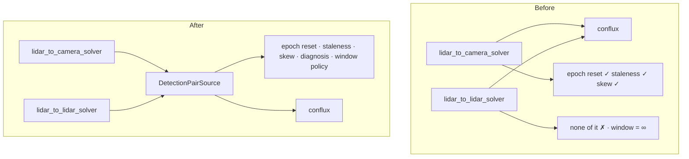

# Architecture review — 2026-08-15

Scoped to the hot spots of the last 60 commits: `lidar_board_detector`, `lidar_to_camera_solver`,
and `board-cluster-detector`. Findings only — nothing here is a decision. Decisions taken from it
become ADRs, and the review is left unedited so a later reader can see what the decision was made
from.

Vocabulary is the one fixed in [README.md](./README.md).

## Where the mass is

| | |
|---|---|
| `ros/lidar_board_detector/src/main.rs` | 3094 lines, one struct |
| `ros/lidar_to_camera_solver/lidar_to_camera_solver/main.py` | 2187 lines, one class |
| Nodes wiring conflux by hand | 3 |
| …of which carry the 2026-08-15 sync fixes | 1 |

---

## 1. The synchronized detection pair, as a module — **Strong**

**Files:** `ros/lidar_to_camera_solver/.../main.py`, `ros/lidar_to_lidar_solver/.../main.py`,
`ros/extrinsic_solver_node/.../main.py` (deleted at Stage 3), `ros/lctk_launch/launch/calibrate.launch.py`

**Problem.** Every solver node wires conflux by hand: build a `ROS2Synchronizer`, register two
subscriptions and a callback, cache the newest pair, and decide what an absent pair means. The
interface each node holds is large — nine parameters, two topics, four counters, and (since the
epoch fix) conflux's private `_sync` handle — while the implementation behind it in each node is a
couple of caches. That is a shallow module repeated three times.

The cost is not hypothetical. Both defects found and fixed on 2026-08-15 were fixed in exactly one
of the three:

| | `lidar_to_camera_solver` | `lidar_to_lidar_solver` | `extrinsic_solver_node` |
|---|---|---|---|
| finite sync window | ✅ 100 ms | ❌ `0.0` hardcoded at `calibrate.launch.py:285` | ❌ |
| epoch reset on a replayed bag | ✅ | ❌ | ❌ |
| staleness gate on the cached pair | ✅ | ❌ | ❌ |
| pair-skew reporting | ✅ | ❌ | ❌ |

`lidar_to_lidar_solver` therefore still pairs by arrival order and still stops permanently when a bag
is replayed. The knowledge exists; it has nowhere to live.

**Solution.** One module owning "the freshest pair of detections that were genuinely simultaneous."
It takes a node and two topics and answers either a pair or the reason there is none. The
synchronizer, window policy, epoch reset, staleness gate, skew measurement and refusal diagnosis all
move behind it.



**Benefits.** *Locality*: the next sync defect is fixed once. *Leverage*: a solver learns two calls
instead of nine parameters plus conflux's ordering contract. *Tests*: the pure decision functions
(`should_reset_for_new_epoch`, `sync_wait_diagnosis`, `sync_pair_staleness_error`) stop being loose
functions inside a 2187-line node and become the module's own test surface, exercised through the
interface rather than beside it. The reach into `sync._sync` becomes an internal seam.

---

## 2. The detection buffer, as a module — **Strong**

**Files:** `ros/lidar_to_camera_solver/.../main.py` (ten service callbacks, ~900 lines),
`ros/lidar_to_camera_solver/test/test_placement_counting.py`, `.../test_pose_weighting.py`

**Problem.** The buffer of board placements is the node's central domain concept — it decides
whether a capture constrains the extrinsic at all — but has no interface: a bare list, a lock, and
ten service callbacks that each mutate it and format a response. The rules that matter (this frame is
a duplicate placement; a solve needs N distinct placements; the pose covariance weights the fit) are
spread across those callbacks.

The tests admit it, reaching past the module because they cannot construct it:

```python
_count_placements = S._count_placements    # unbound method, fake self
w_tight = S._pose_weight(tight, corners)   # static reach-through
solver = S.__new__(S)                      # construct without __init__
rvec_w, tvec_w = S._refine_pnp_weighted(...)
```

*The interface is the test surface.* When a test needs `__new__` to dodge the constructor, the
module is the wrong shape, not the test.

**Solution.** A module holding the placements and the solve, importing nothing from `rclpy` — the
rule that already makes `board_geometry.py` and `detection_format.py` testable. Adding a pair returns
a result the caller renders; the service callbacks become the thin adapters they should have been.

**Benefits.** *Locality*: the "is this a new placement?" rule lives once. *Leverage*: Stage 2's
`continuous` mode needs this module and nothing else from the node. *Tests*: the reach-through tests
become ordinary calls. Deletion test passes — delete it and the placement rules scatter back across
ten callbacks.

---

## 3. Board visualisation out of the detector node — **Worth exploring**

**Files:** `ros/lidar_board_detector/src/main.rs:2348-2931`

584 of the node's 3094 lines build RViz markers: bbox, board, plane, ICP correspondences, per-iteration
debug poses. Pure geometry-to-message code with no ROS behaviour beyond the message types, sitting
inside the node struct and therefore untested. Phase 1's frame change had to be verified by an
operator looking at where an axis arrow pointed — this is the code that draws the arrow, and marker
positions could be asserted instead.

Rough distribution of the node's 3094 lines: parameters/config ~450, detection pipeline ~620,
markers 584, cloud decoding ~300, covariance ~350, remainder ~790.

---

## 4. PointCloud2 decoding as one module — **Worth exploring**

**Files:** `ros/lidar_board_detector/src/main.rs` (`convert_pointcloud2_to_points`, `read_coord`),
`ros/pointcloud_image_overlay/.../overlay_node.py`, `rust/board-cluster-detector/src/background.rs`

Field offsets, datatypes, endianness and point striding are decoded in three places across two
languages. *Two adapters means a real seam* — this one has three, so a malformed-cloud fix in the
detector is not a fix in the overlay. Weaker than 1 and 2 only because the duplication is stable and
low-churn: worth doing when one of those files is next opened.

---

## 5. The detection pipeline as a value, not a procedure — **Speculative**

**Files:** `ros/lidar_board_detector/src/main.rs:904-1218` (`process_pointcloud`)

A 300-line procedure that filters, fits a plane, runs ICP, scores the fit and publishes eight debug
topics along the way, with early returns that publish an empty detection array. Publishing is braided
through the decision-making, so the decisions cannot be tested and reject reasons can only be read
from logs. Deepening means returning a result — detection, or rejection with a reason, plus debug
artefacts — and letting the node publish.

Speculative because `docs/superpowers/plans/2026-07-28-boarddet-reject-reason-diagnostics.md` is
already in flight over this area and should absorb it rather than compete with it.

---

## Top recommendation

**Candidate 1.** The argument is a live bug rather than a principle: `lidar_to_lidar_solver` still
carries both defects fixed on 2026-08-15, because the fix had nowhere to live except inside one
caller. It is also the cheaper of the two strong candidates — the behaviour is already written and
already tested as pure functions; it needs a home, not an invention.

Candidate 2 is the natural follow-up, and Stage 2 of the diamond-frame work wants it anyway.
