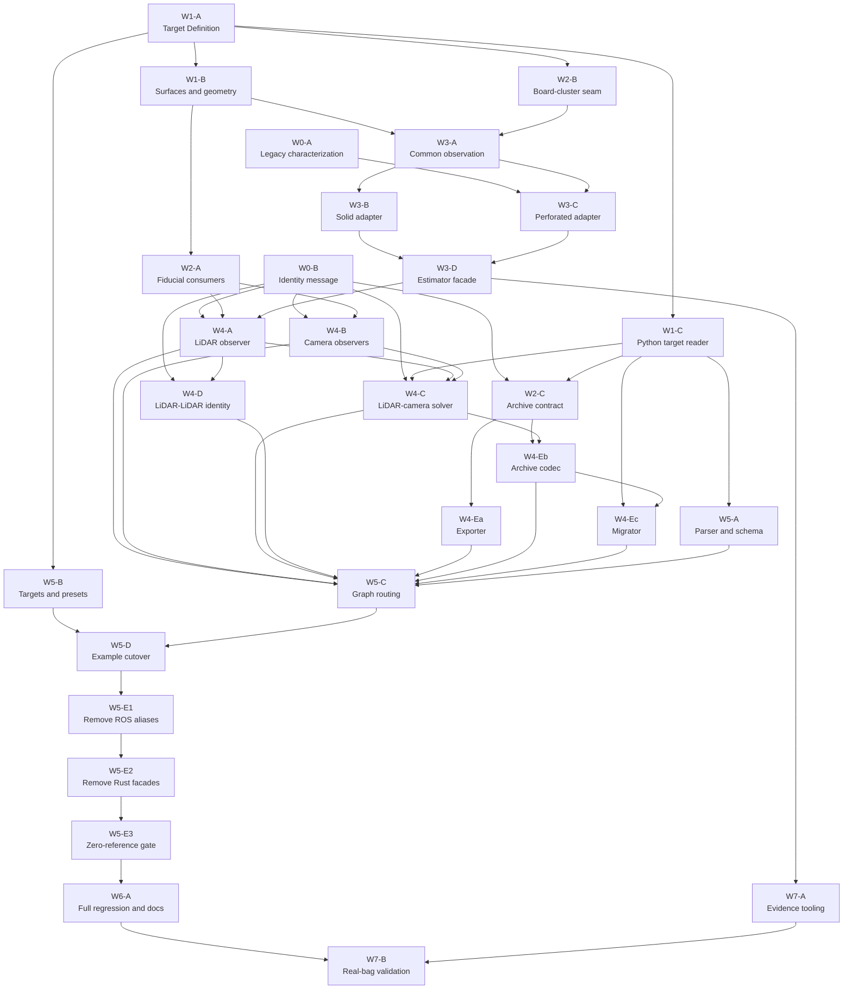

# Phase 8: Selectable Calibration Targets

- **Status:** Active implementation
- **Date:** 2026-08-27
- **Spec:** [Selectable calibration targets](../superpowers/specs/2026-08-21-selectable-calibration-targets.md)
- **Decision:** [ADR 0003](../adr/0003-selectable-calibration-targets.md)

## Current implementation state

Updated 2026-08-28. Packet status changes land here with each accepted review gate.

| Packet | State | Evidence / commit |
|---|---|---|
| W0-A | Complete | Legacy detector contract tests, `62f8c9d` |
| W0-B | Complete | Target Identity message, `9a4e6d7` |
| W1-A | Complete | Target Definition contract, `81abb0d` |
| W1-B | Complete | Canonical target geometry, `5aa1f73` |
| W1-C | Complete | Python target reader, `a5f6ce8` |
| W2-A | Complete | Target-derived fiducial patterns, `e6080b1` |
| W2-B | Complete | Neutral cluster evidence, `e21aa01` |
| W2-C | Complete | Archive identity contract, `77a1720` |
| W3-A | Complete | Neutral square/plane observation, `fd7411e` |
| W3-B | Complete | Solid evidence refinement and public-facade tests, `ea0eda4` |
| W3-C | Complete | Perforated ICP adapter and legacy characterization golden, `ea0eda4` |
| W3-D | Complete | Typed neutral estimator and temporary hollow facade, `ea0eda4` |
| W4-A | Complete | Selectable LiDAR observer, neutral estimator adapter, and hollow/solid regressions, `d6a37ca` |
| W4-B | Complete | Target-driven camera/generator adapters, `2ab0944`; binding cache fix, `dcb46e4` |
| W4-C | Complete | Shared target geometry, exact three-way identity gate, and legacy graph identity routing, `f97156e` |
| W4-D | Complete | Atomic two-LiDAR identity gate and synchronized-pair admission, `e9acdaf` |
| W4-Ea | Complete | v4/v5 export parity, `82eb8a5` |
| W4-Eb | Complete | Codec/runtime, dump identity gate and atomic write, `7782ad0` |
| W4-Ec | Complete | Version-dispatching migrator with marker-ID gate, `41dd046` |
| W5-A | Complete | Selectable launch schema parser, `42a7934` |
| W5-B | Complete | Hollow/solid detector presets, `a0664db` |
| W5-C | Complete | Generated graph and identity routing (`1884b3d`, `eb58770`), graph invariants, `7839cf1` |
| W5-D | Complete | Maintained-example cutover and first solid example, `24224c8` |
| W5-E1 | Complete | Legacy schema removed from nodes, parser, launch and config, `fc512e8` |
| W5-E2 | Complete | Facade crates deleted, coverage migrated, `21142ac`; H-15 ICP sign fix, `fcf9f06` |
| W5-E3 | Complete | Zero-reference sweep, dead config removed, `aab0125` |
| W7-A | Complete | Evidence schema/collector reviewed; test-suite negatives added, `6143676` |

W4-C/W4-D combined gate passed: final Terra audit clean, `just build` (17 ROS packages), `just test`
(317 Rust and 301 Python tests), `just lint-py`, deterministic cache/session race tests, and
`git diff --check`.

Active dependency path: W6-A (full headless release gate), which W5-E3 has now unblocked. W5-C was the last packet Wave 4 blocked; it routed the new `target_config`/`detector_config`
fields through the generated launch graph for every node that carries them (W4-C only added the
identity routes required to keep the maintained legacy graph functional while gates activate), and
W5-D has now put every maintained example on those fields. W6-A is the last packet before W7-B. W7-B requires real rosbag evidence and is not headlessly closeable.

Wave 4 is complete. W4-Ec passed its gate with `just test` (317 Rust and 361 Python tests) and
`just lint-py`: v3-to-v4 is unchanged and still writes a literal version 4, v4-to-v5 binds an
operator-selected target after checking every observed marker ID, version 3 is refused a one-command
path to version 5, and both hops write atomically so no rejection or failed write leaves a file
behind.

W4-Eb/W7-A gate passed on a migrated machine: `just build` (17 ROS packages), `just test`
(317 Rust and 337 Python tests), `just lint-py`, and `git diff --check`. The dump path now refuses a
closed identity gate, rechecks the gate generation immediately before an atomic `os.replace`, and
leaves no temp-file debris behind a refusal; gating stays identity-only so a one-Capture result
remains savable per the accepted spec. W7-A's collector needed no production change; its fixtures
now declare `test_only` provenance and cover the previously untested schema negatives. ROS bag
extraction remains deferred until diagnostic topic/message mappings stabilize.

W5-C's acceptance text ("generated graph contains one locator per camera, one selected target per
sensor and the exact identity remaps; all legacy-schema tests still use the compatibility path")
is now proved as graph-level invariants in `test_calibrate_launch_graph.py`, on top of the
per-node routing C1/C2 already covered: one camera paired with two LiDARs against the same marker
still yields exactly one `aruco_locator_node`; every node touching a given sensor — including the
two solvers a shared camera produces — names the identical `target_config`. Read that second
invariant as the routing check it is, not as a limit on what may be calibrated: every sensor in a
session observes the same physical board at the same instant, which is what makes a correspondence
between them exist at all, so the only failure it can catch is routing handing two nodes different
values for one shared target. Beyond that, the new-schema LiDAR-camera solver's
`lidar_target_identity`/`camera_target_identity` remaps resolve, by exact string equality, to the
actual namespaces `generate_nodes` gave its own detector and locator, not to an independently
recomputed string; and every maintained example under `config/examples/` (parametrized off disk, so
a future example is covered automatically) generated, at that time, a graph carrying only legacy
configuration keys — W5-D has since inverted that assertion, keeping the same disk parametrization,
the same explicit handling of the zero-locator/zero-solver case (`two_lidar.yaml`) rather than a
vacuous pass, and the same import-time failure on an empty parametrization.
The `ros/lctk_launch` suite is 82 tests, 74 before this packet. W5-C's gate passed with
`just build` (17 ROS packages), `just test` (317 Rust and 374 Python tests, 361 before this
packet), `just lint-py`, and `git diff --check`.

`demo.launch.py` needed no change: neither routing commit added a `DeclareLaunchArgument` to
`calibrate.launch.py`, because `target_config` and `detector_config` are resolved from the config
file's marker section inside `generate_nodes` rather than from top-level launch arguments. Its
forwarding list (`debug_mode`, `log_level`, `mode`, `enable_rviz`, `solver_mode`, `enable_overlay`,
`enable_judge`) and its hardcoded `config_file:=sample_data.yaml` remain correct against the new
routing, and stayed correct through W5-D: that packet changed what `sample_data.yaml` contains, not
its path, so the demo now runs the new schema without `demo.launch.py` changing at all.

Two launch-layer changes landed outside any packet while W5-C was closing, both prerequisites for
the solid example W5-D adds. `079b983` stops `config_parser` demanding `bbox_config`: the board
detector reads a crop box only when its tuning selects `detection_mode=bbox`, and every preset
except `board_detector.json5` is `bbox_free`, so the solid presets could not have been used without
naming a file nothing reads. Enforcement now sits in the node, which is the only component that
parses detector tuning. `dff2bca` moves the Conflux window, queue size and drop policy out of the
`mode` argument into a required `sync:` section of the calibration config, leaving `mode` owning
QoS alone; the window is a judgement about how far the target moves between a camera frame and a
LiDAR sweep, which live-versus-recorded cannot answer. Every example kept its existing values, so
neither change retunes anything. The same commit deletes the unread `config/detection_sync.yaml`.

W5-D settled that packet's open question about the seyond configs: both keep
`queue_size: 100`/`drop_policy: reject_new`. The evidence is in the files themselves — each opens by
listing *rosbag* topics and by telling the reader how to republish a compressed image stream from a
bag — so they are replay configs, and `reject_new` is the policy that loses no recorded data. The
live-rig variant remains real: a rig driven from live sensors wants a small queue and `drop_oldest`,
which is a retune for whoever drives one, not a default to guess at here.

W5-D put every maintained example on `target_config`/`detector_config`, so no maintained launch
depends on a compatibility parameter any more — which is the precondition W5-E1 was waiting on. The
cutover retunes nothing: each example keeps the operating point it ran under, and the seyond examples
move to `hollow_1000/seyond.json5`, which carries `board_detector_seyond.json5`'s values verbatim.
`two_lidar.yaml` keeps its two different operating points by giving `top_lidar` the marker-level
velodyne preset and overriding `front_lidar` to the seyond one, which is also the first maintained
demonstration of a per-LiDAR `detector_config`. Every dropped `bbox_config` belonged to a `bbox_free`
preset that never read it.

`sample_data.yaml` is the one example that could not simply take an existing preset. It has always
run `board_detector.json5`, which selects `detection_mode: bbox` and genuinely reads `bbox.json5`,
and there was no bbox-mode preset under `config/board/hollow_1000/`. Pointing it at the bbox_free
preset would have flipped the Stage-1 path of exactly the calibration route
[M-17](../issues/M-17-initial-pose-rewrite-unverified-bbox-path.md) records as never measured, so
`hollow_1000/velodyne_bbox.json5` copies that template minus the four geometry keys the Target
Definition now owns. `test_hollow_presets_preserve_the_current_sensor_operating_values` compares the
two files key by key and refuses any key the template lacks, because "only geometry was removed" is
the entire claim and one changed number would be a silent retune of the shipped demo.

`solid_600_handheld.yaml` is the first maintained example selecting the solid target. No recording
for it is in the repo and none is needed: it names topics, so data can arrive later without a config
change. Its header records what the values cannot: the `solid_600/velodyne` preset is experimental
rather than field-validated; the intended recording is a hand-held board moved slowly over tens of
seconds, which the spec names as the intended evidence source rather than a defect; the recording
must open with at least 20 board-absent frames (~2 s at 10 Hz) or `bg_warmup_frames` never finalizes
the background; and `sync.tolerance_ms` is 50 rather than 100 because a moving board makes a
mis-paired camera frame and LiDAR sweep *wrong*, not merely noisy. That 50 ms is stated intent, not a
measurement — it is to be confirmed on a first replay against the `pair skew last=/max=` figures
`DetectionPairSource` logs, and the file says so rather than implying a tuned value.

The maintained examples had also been serving as the legacy schema's test fixtures, so that coverage
moved into `tmp_path` configs the tests write themselves — including the per-LiDAR `board_config`
override, whose only exercise anywhere had been the old `two_lidar.yaml`, and which W5-E1 will delete
a packet from now. The `ros/lctk_launch` suite is 90 tests, 82 before this packet. W5-D's gate passed
with `just build` (17 ROS packages), `just test` (317 Rust and 400 Python tests, 374 before this
packet), `just lint-py`, and `git diff --check`.

One environment note, not a code finding: `just build` first failed with `error: can't copy
'build/lctk_launch/config/detection_sync.yaml': doesn't exist or not a regular file`. `dff2bca`
deleted that config, but `--symlink-install` leaves the dangling symlink in `build/` behind and
colcon then tries to copy it. `rm -rf build/lctk_launch install/lctk_launch` before `just build`
clears it; nothing in the source tree references the file.

Fresh-clone build note: a clean tree could not build until `sync-root-cargo-config.sh` learned to
synthesise the root `[patch.crates-io]` block as the union of every per-package block (`0df4f48`).
The generated golden fixtures under `rust/board-cluster-detector/tests/fixtures/` are gitignored and
must be regenerated with `experiments/board-detection-2d/tools/export_golden.py` before the Rust
suite is complete on a new machine.

W5-E1 deleted the compatibility path W5-D left without callers: the four legacy node parameters
(`board_detector_file`/`aruco_pattern_file` on the detector, `aruco_config_file` on the locator and
the LiDAR-camera solver), `_parse_legacy_marker` and its hollow translation, the launch file's
`_uses_target_definition` branching, and the four config files only the old schema read
(`config/aruco/aruco_pattern.json5` and `config/board/board_detector{,_velodyne,_seyond}.json5`).
Net −592 lines before the deletions themselves.

An old config is now refused rather than translated, at two entry points: a marker carrying
`type`/`board_config`/`aruco_config`, and a lidar device carrying `board_config`. The device case is
the one that had to be a refusal rather than a deletion — `config_parser` read that key with
`config.get()`, so simply removing the legacy path would have let an old config parse and then run
against the wrong detector tuning with nothing reported. Both messages follow the detection-archive
refusals in `detection_format.py`, on the same reasoning those state: automatic translation would
make a config's meaning depend on the build that opened it, and the retired board/ArUco files carry
split, non-authoritative geometry that no rule can turn into detector tuning.

Coverage moved rather than evaporated wherever the claim outlived the schema. The two-LiDAR graph
test kept both its identity remaps and its per-LiDAR override assertion, restated against
`detector_config`; it remains the only launch-graph proof that an override reaches the right node,
since the parser-level test checks dataclasses rather than generated `Node` parameters. The hollow
point-cloud regression — the only exercise of the perforated observer adapter's plane/square handoff
— now parses the manifest directly instead of reaching it through the legacy source. One test was
retired deliberately; see "A preservation test was deliberately retired, not lost" below.

W5-E1's gate passed with `just build` (17 ROS packages), `just test` (316 Rust and 397 Python tests;
317 and 400 before this packet, the difference being deleted legacy tests net of added rejection
tests), `just lint-py`, and `git diff --check`. The dangling-symlink build failure W5-D recorded
recurred exactly as predicted after deleting four config files, and cleared the same way.

L-19 closed as a side effect: the parser guard that made `aruco_config` mandatory for LiDAR-only
markers is gone along with the field. Three findings surfaced during the packet were filed as M-26,
M-27 and L-30, and M-16 gained an update recording that later evidence contradicts its "never run
end-to-end" text without settling it. One documentation debt is left for W5-E3/W6-A:
`ros/lctk_launch/README.md`, `ros/lctk_launch/config/README.md` and
`ros/lidar_board_detector/README.md` still document a retired XML launch interface and now point at
deleted files.

W5-E2 deleted `rust/hollow-board-config` and `rust/hollow-board-detector`, `fixtures/board/`, and
the `side_m` compatibility adapter. The lockfile shed both crates and their exclusive transitive
dependencies. "Finish neutral crate/directory names" required no renames -- the two deletions
complete it -- and `members = ["rust/*"]` is a glob, so no manifest edit was needed.

The adapter was removed without removing the function it wrapped. `detect()` is not a thin shim:
beyond delegating to `detect_for_target` it owns pose construction, the legacy
stance-before-isolation gate order and lowest-residual selection, and the Python-parity goldens over
~50 MB of recorded fixtures compare against its pose output, which neutral evidence cannot produce.
`BoardConfig`, its private `side_m` and the `d_side_m() -> 1.0` hollow assumption are gone; the
physical side now enters as a `TargetSide` argument. All three parity goldens still pass.

Coverage moved before the crates did. The ICP convergence suite went to
`calibration-target-detector`, the voxel tests to `board-cluster-detector` and the node, and the
paper-placement test to `calibration-target`. The voxel move was a net gain rather than a
preservation: those tests described a dead triplicate, while the node's live implementation had no
tests at all despite owning the `use_centroid = false` branch. `fixtures/board`'s generator was
ported to `fixtures/targets/`, which held a golden with three consumers and no generator -- its
standing instruction not to re-baseline from implementation output previously had no way to be
obeyed. The ported generator reproduces the committed golden to 5.8e-16 m from stdlib and json5
alone.

**Migrating the ICP suite exposed [H-15](../issues/H-15-perforated-icp-applies-correction-backwards.md),
a shipped defect: the perforated ICP applied its Kabsch correction backwards, so every iteration
moved the board pose away from the observed points.** It dated from W3-C and came from a naming trap
-- the old crate's correspondence tuples were `(sensor, model)` but its unzipped variables were
named the other way round, so the migration swapped the argument order while keeping an `.inverse()`
that the swap had already performed. The code carried a comment asserting the inversion matched the
legacy ordering exactly; it did not.

Nothing could have caught it before this packet. Every prior ICP test seeded at or beside the true
pose, where the correction is the identity and the identity is its own inverse; the characterization
golden pins per-step metrics computed *before* the pose update and so is blind to its direction,
passing unchanged across the fix. The one property that could catch it -- convergence from a
perturbed seed -- was the one property no test had. This is a concrete instance of the first
outstanding item below: the defect survived every headless gate and would have been found on the
first real replay.

One deliberate loss, recorded as a decision rather than an oversight: `old_frame_projection` and its
reparameterisation test, the last executable statement of the pre-diamond board convention. That
convention is unreachable (archives below version 4 are refused) and the bug class it guarded is
structurally gone, the neutral frame being hard-coded constants rather than a computation that could
be relabelled by 45 degrees.

W5-E2's gate passed with `just build` (17 ROS packages), `just test` (276 Rust and 397 Python
tests), `just lint` including clippy, and `git diff --check`. The Rust count falls from 316 because
the deleted crates took ~60 tests with them, 20 having been migrated or newly written first; the
remainder were superseded suites and tests of dead code. `rust/plane-estimator` is now fully
orphaned -- its only dependent was `hollow-board-detector` -- and is a candidate for W5-E3's sweep.

W5-E3 closed the zero-reference gate. Nine dead config files went: the four `multi_wayside.json5`
under `config/lidar_to_lidar{,_ntu}/`, the four under `config/multi_wayside/`, and
`lidar_to_camera_solver`'s `extrinsic_solver_node.launch.xml`. The multi_wayside family belonged to
a node that no longer exists, its relative paths had dangled since an earlier reorg, and
`multi_wayside/detector.json5` was the last live file duplicating `board_width`/`hole_radius`/
`hole_center_shift` -- so the packet's physical-geometry-duplication check is clean. The launch file
was never installed at all: that package's `setup.py` globs only `launch/*.py`.

Docs were repaired rather than renamed where a passage explained a real concept through a deleted
file -- the board-frame contract's test home, the pre-split config surface, and a structure section
still describing an `src/lib/`-era layout whose links predated this phase. Three of the fixes were
pre-existing errors rather than fallout: a documented `bbox.json5` schema matching no real bbox
file, a book example whose ICP values did not match the preset it named, and commands invoking
launch files that no longer exist.

Issue pointers in M-21, M-14, H-11 and M-17 were repointed without altering their claims. M-21
gained a note that the migrated convergence suite re-measured its stable-pose finding on the 1 m
manifest at roughly 1809 iterations -- the same order as the ~639 measured on the old 0.5 m board,
so the finding holds on the new geometry and the post-H-15 code.

**Issue-ID collision with `origin/main`.** This branch is 20 commits behind `origin/main`, which had
already allocated H-14, M-23, M-24, L-26 and L-27 to unrelated conflux work. All five IDs filed
during this session collided and were renumbered before merge: H-14 to H-15, M-23 to M-26, M-24 to
M-27, L-26 to L-30, L-27 to L-31. Commit `fcf9f06` still names H-14 in its message, which cannot be
rewritten; H-15 carries a note saying so. The wider point for whoever merges: this branch has
diverged far enough that a rebase onto current `main` is a real operation, not a formality, and it
was left as the maintainer's call.

`rust/plane-estimator` now has zero consumers -- its only dependent was a crate W5-E2 deleted, and
`lidar_board_detector` has its own RANSAC plane fit. Deleting a crate is a scope decision rather
than a reference repair, so it is filed as L-31 rather than actioned here.

W5-E3's gate passed with `just build` (17 ROS packages), `just test` (276 Rust and 397 Python
tests), `just lint` including clippy, `git diff --check`, and a relative-link check over `docs/`
reporting zero broken links.

## Outstanding items no packet owns

These are gaps and hazards that surfaced while implementing Phase 8 but that no packet's scope
covers. They are recorded here so they live in the plan rather than only in conversation.

**The new schema has never been run against data.** Every Phase 8 packet gate is `just build`,
`just test`, `just lint-py` and `git diff --check` — all headless. The launch graph is proven by
`ros/lctk_launch/test/test_calibrate_launch_graph.py`; nothing proves the runtime. No packet owns
"launch the pipeline on a real recording and confirm a solved extrinsic": W7-B is specifically
about tuning and promoting the solid presets, and it depends on W6-A, so it does not cover the
maintained hollow examples either. The first person to run any maintained example on real data
after this phase is performing an experiment, not a regression check, and that gap is recorded
here on purpose rather than left implicit. `config/examples/sample_data.yaml` is the only
maintained example with matching data already in the repo (`ros/lctk_sample_data/data/3/`, pcap +
avi, driven by `just sample-data`), so it is the cheapest way to close this gap; every other
maintained example is either illustrative only (`vehicle.yaml`'s placeholder topics), names a
rosbag that ships nowhere in the repo (`seyond_left.yaml`, `seyond_right.yaml`), depends on the
gitignored `bags/TWO_LIDAR_*` (`two_lidar.yaml`), or by design has no recording at all
(`solid_600_handheld.yaml`).

**`sample_data.yaml` sits on the detection path M-17 says is unverified.** W5-D deliberately kept
it in `bbox` mode, via `config/board/hollow_1000/velodyne_bbox.json5` (see "Current implementation
state" above for why), rather than retuning it onto the bbox-free preset. That means the one
runnable example a first real-data check would reach for exercises exactly the Stage-1 path
[M-17](../issues/M-17-initial-pose-rewrite-unverified-bbox-path.md) records as never measured
against the pre-rewrite construction. Preserving the shipped operating point over the untested one
was the right call for W5-D's own scope — a launch cutover is not the place to also silently
change what a shared initial-pose call site does — but it means the cheapest runtime check
available today runs over the least-verified detector path in the repo. Both halves are true at
once; neither cancels the other.

**A config file can be compiled into a binary, and W5-E1 already ran into it.**
`config/board/board_detector.json5` was `include_str!`'d into the `lidar_board_detector` binary at
three call sites — one in `bbox_free.rs`, two in `main.rs` — so deleting it would have broken
`just build`, not merely `just test`. Commit `fc512e8` (W5-E1) caught this and repointed all three
at `config/board/hollow_1000/velodyne_bbox.json5`, W5-D's geometry-free copy of the same template,
before removing the file; its own commit message records the same reasoning. The general hazard
remains for W5-E2 and W5-E3, which delete more files: a grep for a *parameter name* will not
surface an `include_str!`/`include_bytes!` coupling, so those packets must also grep for the file
name itself. As of that commit, the config files still compiled into a Rust binary this way are:
every `bbox*.json5` file under `config/board/` (eight sites, all in
`ros/lidar_board_detector/src/bbox.rs`); `config/board/hollow_1000/velodyne_bbox.json5` (three
sites, `bbox_free.rs` and `main.rs`); and the two target manifests
`config/targets/hollow_1000_aruco_4_v1.json5` and `config/targets/solid_600_aruco_1_v1.json5`
(seven `include_bytes!` sites total across `ros/lidar_board_detector/src/main.rs` and
`ros/aruco_locator_node/src/main.rs` — four for the hollow manifest, three for the solid one).

**A preservation test was deliberately retired, not lost.**
`test_hollow_presets_preserve_the_current_sensor_operating_values` (added in `a0664db`, extended in
`24224c8`) compared `config/board/hollow_1000/{velodyne,seyond}.json5` against the legacy
`board_detector_velodyne.json5`/`board_detector_seyond.json5` key by key, and
`hollow_1000/velodyne_bbox.json5` against `board_detector.json5` — it was the one-time proof that
the Phase 8 cutover did not silently retune a shipped operating point. `fc512e8` removed the test
along with the legacy files it compared against, because once those files are gone the comparison
has no other side left to diff. This was a decision, recorded in that commit and in
`ros/lctk_launch/test/test_target_presets.py`'s trailing comment, not an oversight. Its evidence is
now historical (`a0664db`, `24224c8`, `fc512e8`); going forward, the only protection against an
unintended hollow retune is code review of a preset diff, not a test.

**`extrinsic_solver_node` is now permanently unstartable, on purpose.**
`ros/extrinsic_solver_node/extrinsic_solver_node/main.py` reads `config["num_squares_per_side"]`
and `config["board_size"]` (`_load_aruco_pattern_config`), keys that existed only in
`config/aruco/aruco_pattern.json5`; `fc512e8` deletes that file as part of W5-E1's scope ("delete
the standalone physical ArUco config"). Nothing regresses: the node was already unreachable from
config-driven launch, and neither of its own launch files
(`ros/extrinsic_solver_node/launch/extrinsic_solver_node.launch.xml`,
`ros/lidar_to_camera_solver/launch/extrinsic_solver_node.launch.xml`) ever sets
`aruco_config_file` — it defaults to `""`, which `_load_aruco_pattern_config` already refuses with
`ValueError("aruco_config_file parameter is required")` before it would ever reach the missing
file. So the node was unstartable through its own shipped launch files before this phase touched
anything; Phase 8 only removes the one config that would have let an operator start it by hand with
an explicit `aruco_config_file` override. Recording this explicitly is so a later reader does not
mistake an already-inert deletion for an accidental breakage. CLAUDE.md already notes the package
is "pending deletion" by the diamond-frame plan.

**Dead configuration awaiting W5-E3.**
`ros/lctk_launch/config/lidar_to_lidar/{wayside1_to_2,wayside2_to_3}/multi_wayside.json5`,
`config/lidar_to_lidar_ntu/{wayside1_to_2,wayside1_to_3}/multi_wayside.json5`, and the four files
under `config/multi_wayside/` all belong to the deleted `multi_wayside_node`; no package by that
name exists under `ros/` any more. Nothing in the repo reads any of these paths — no launch file,
no node, no justfile recipe — and even if something did, all four `multi_wayside.json5` files'
`board_detector: '../../board_detector.json5'` and `aruco_pattern: '../../aruco_pattern.json5'`
relative paths already resolve to `config/board_detector.json5` and `config/aruco_pattern.json5`,
neither of which exists (the real files, now deleted by W5-E1, lived a directory level deeper,
under `config/board/` and `config/aruco/`). `ros/lidar_to_camera_solver/launch/
extrinsic_solver_node.launch.xml` is in the same state: nothing in the repo references that
filename either. These belong to W5-E3's zero-reference sweep. The issue tracker may separately
carry an entry for that orphaned launch file; that is a parallel finding, not one to duplicate
here.

**CLAUDE.md is stale on the detection archive format.** It documents "Detection File Format
(version 4)" with a `"version": 4` example. `ros/lidar_to_camera_solver/lidar_to_camera_solver/
detection_format.py` sets `FORMAT_VERSION = ARCHIVE_V5` and refuses to restore a v4 archive,
requiring the explicit `migrate_detections` migration command instead. This is in scope for W6-A
("update CLAUDE.md, package READMEs and book workflow/migration pages"), but it is worth flagging
as actively wrong today, not merely outdated: an operator following CLAUDE.md's own example would
write a file the current code refuses to load.

## Outcome

LCTK supports either the existing 1000 mm perforated target or the new 600 mm solid target. The
operator selects one Target Definition per sensor before launch. Physical geometry and fiducial
layout cross one deep Calibration Target interface; sensor-specific Detector Tuning stays separate.

This plan deliberately avoids a repository-wide flag day. New modules land beside temporary
compatibility facades, callers migrate in dependency order, and obsolete hollow-specific interfaces
are deleted only after the complete launch graph passes regression tests.

No phase may silently change transform direction, continuous-solver capture policy, hollow ICP
termination, or historical sample-data provenance.

## Delivery rules

1. One work packet is one bounded subagent assignment and normally one reviewable commit.
2. Every packet leaves its branch buildable and testable. Temporary compatibility is explicit,
   rejects conflicting old/new inputs, and has a named deletion packet.
3. One integrator owns the feature branch. Subagents edit only their assigned paths; the integrator
   handles shared manifests, lockfiles and final merges.
4. Parallel agents require disjoint primary ownership. Agents never perform simultaneous branch
   switches in the shared workspace; use sequential dispatch or separate worktrees.
5. Targeted tests run inside a packet. Every wave ends with `just build` and `just test`; Python
   waves also run `just lint-py`. The final headless gate runs `just lint`.
6. Builds use `just build`, never raw `cargo build` or `colcon build`. Interface-message changes
   follow CLAUDE.md's rosidl clean/regeneration procedure.
7. Real bags decide field performance. Synthetic data verifies algorithms and schemas only.

## Stable seams during migration

### Rust

Add `rust/calibration-target` before changing callers. Until cleanup,
`rust/hollow-board-config` is a compatibility facade for the legacy hollow constructors. Likewise,
the new `rust/calibration-target-detector` is introduced before the old detector crate disappears.
There is never a `hole_radius = 0` solid-board sentinel.

The target estimator's implemented external interface is:

```rust
let target = ValidatedTarget::parse_json5(bytes)?;
let estimator = TargetPoseEstimator::new(&target, tuning)?;
let observation = TargetSquarePlaneObservation::from_square_plane(&square_plane, sensor_up)?;
let outcome = estimator.estimate(observation, selected_points);
```

Surface dispatch, quarter-turn hypotheses, evidence ownership and `BoardIcpIterator` stay internal.
Tests and ROS callers cross the same interface.

This refines the spec's shorthand `estimate(points, sensor_up)`: W4-A's bbox and bbox-free
selectors own crop/background state and produce the same neutral square/plane evidence. Moving raw
cloud selection into the estimator would duplicate that stateful observer policy and make the two
selection modes diverge again.

### Python

The accepted `load_target(path) -> ValidatedTarget` interface has three callers: launch validation,
the LiDAR-camera solver/migrator, and archive tests. Put it in one ROS-free Python module rather than
copying canonicalization. Preferred home: a small `ros/lctk_target` ament-python package. During
migration, `lidar_to_camera_solver.board_geometry` may re-export legacy hollow helpers; it is deleted
in cleanup.

This is an implementation-level deepening of the spec's proposed solver-local
`target_geometry.py`: ownership moves to the shared domain module, but the accepted value interface
and semantics do not change.

### Runtime identity

Identity publishers may land before enforcement. Enforcement becomes active only when both observer
publishers, both solver subscribers and launch remaps are present. There is no permissive production
fallback after the activation packet.

### Configuration

Nodes may temporarily accept one legacy config parameter to keep old examples runnable. Supplying
both old and new parameters is an error. The compatibility path always means the explicit hollow
Target Definition; it cannot describe a second target. The launch cutover changes all maintained
examples atomically, after which cleanup removes the aliases.

## Dependency graph



## Work packets

### Wave 0 — Freeze behavior and create the wire type

#### W0-A — Characterize the legacy hollow path

**Owner:** Rust detector tests only.

**Scope:**

- pin current hollow surface projection and marker-corner goldens;
- pin `BoardIcpIterator` step/termination outputs without fixing M-21;
- add bbox and bbox-free characterization around the square-fit evidence currently discarded;
- record target-sized Detection3D/RViz behavior that is intentionally wrong today as assertions in
  new-target tests, not as a legacy golden.

**Primary files:**

- `rust/hollow-board-config/tests/`
- `rust/hollow-board-detector/tests/`
- `rust/board-cluster-detector/tests/`
- `fixtures/board/`

**Acceptance:** existing and added characterization tests remain green. Tests for interfaces that do
not exist yet wait for their owning packet. No production behavior changes.

#### W0-B — Add `CalibrationTargetIdentity.msg`

**Owner:** ROS interface package only. Parallel-safe with W0-A.

**Scope:** add the accepted five-field message and register it in rosidl.

**Primary files:** `ros/lctk_interfaces/msg/`, `CMakeLists.txt`, `package.xml` only if required.

**Acceptance:** regenerated Python and Rust bindings expose all fields; `just build` and `just test`.

### Wave 1 — Build the Calibration Target domain module

#### W1-A — Target Definition schema and semantic identity

**Depends on:** W0-A.

**Scope:**

- add `rust/calibration-target` beside the old crate;
- add strict schema parsing and field-specific validation;
- add explicit solid/perforated surface variants and LiDAR Orientation Reference;
- add the two accepted target manifests;
- implement canonical semantic bytes and SHA-256 identity;
- keep `hollow-board-config` compiling; no caller migration yet.

**Primary files:**

- `rust/calibration-target/`
- `ros/lctk_launch/config/targets/`
- target-schema fixtures under `fixtures/targets/`
- root `Cargo.toml`/`Cargo.lock` by integrator.

**Acceptance:** invalid-field table; equivalent units/comments/key order hash equally; every semantic
mutation changes the hash; cutout geometry and marker placement validate; targeted crate tests plus
wave `just build && just test`.

#### W1-B — Target geometry and surface adapters

**Depends on:** W1-A. **Parallel-safe with W1-C.**

**Scope:** move canonical axes/corners/paper mapping behind `ValidatedTarget`; implement solid plane
and perforated cutout closest-point adapters; preserve randomized diamond-frame and boundary
projection contracts.

**Critical rule:** do not reuse `board_cluster_detector::pose::BoardDetection` as the target pose.
Its `[forward,left,up]` axes differ from `corner_aligned_plate_center_v1`. Square/plane evidence stays
neutral until the target estimator constructs canonical axes.

**Acceptance:** property tests for both surfaces; hollow golden unchanged; explicit cutout validation;
deleting the new module would force geometry logic back into multiple callers.

#### W1-C — Shared Python Target Definition reader

**Depends on:** W1-A. **Parallel-safe with W1-B.**

**Scope:** implement the same immutable value interface, validation, marker expansion, canonical
bytes and identity in one ROS-free Python package. Consume the same target manifests and goldens.

**Primary files:** new `ros/lctk_target/`, Python geometry/identity fixtures, package registration.

**Acceptance:** Rust/Python canonical bytes, hashes and marker corners match for both targets; exact
solid marker side is 480 mm; 1x1 and 2x2 layouts pass; malformed/duplicate IDs fail; `just lint-py`.

### Wave 2 — Open independent consumer seams

These three packets can run in parallel after their dependencies. They must not edit each other's
primary files.

#### W2-A — Generalize fiducial detection and generation

**Depends on:** W1-A and W1-B.

**Scope:**

- keep low-level dictionary/rendering types in `aruco-config`;
- derive physical pattern and paper placement from a Target Definition;
- add exact 1x1/ID 1 detector and generator tests;
- preserve 2x2 hollow behavior and OpenCV corner ordering.

**Primary files:** `rust/aruco-config`, `aruco-detector`, `aruco-locator`, `aruco-generator`.

**Acceptance:** generated solid image is 600 mm logical paper with 60 mm white margin and 480 mm
marker; detector accepts exactly ID 1 for that profile; hollow renderer golden remains stable.

#### W2-B — Inject target size into board clustering

**Depends on:** W1-A and W0-A.

**Scope:** add the target-side detection interface and return the raw `SquareFit`/plane observation
instead of discarding it. Keep a deprecated compatibility adapter that reads serialized `side_m` for
unmigrated callers; it delegates immediately to the new interface. W5-E2 removes `side_m` and the
adapter after every caller has moved. Absorb L-17's duplicated geometry/default ownership without
changing unrelated tuning defaults.

**Primary files:** `rust/board-cluster-detector/src/{config,detector,square_fit,pose}.rs` and tests.

**Acceptance:** 0.6 m and 1.0 m fixtures; existing real-fixture decision parity; no target-frame axis
construction inside this module.

#### W2-C — Define the shared archive contract

**Depends on:** W1-C and W0-B.

**Scope:** add paired v4/v5 solved fixtures and pure validators. Keep distinct rules:

- v5 is restorable only with exact local Target Identity;
- v4 is transform-exportable but not restorable;
- v3-to-v4 migration always stamps literal version 4, even after the current format becomes 5.

**Primary files:** `fixtures/detection_archives/` and narrow validator tests in solver/exporter.

**Acceptance:** malformed identity table; 64-character lowercase hash validation; paired v4/v5
fixtures carry identical solved transforms; `just test`.

### Wave 3 — Implement the target pose estimator

#### W3-A — Common square-and-plane observation

**Depends on:** W1-B and W2-B.

**Scope:** construct neutral square/plane evidence, four board-up candidates and alignment scores.
The common result is an observation, not a final Calibration Target pose.

**Acceptance:** normal-sign, center and corner-order tests; dot examples `1.0`, `0.924`, `0.866`,
`0.707`; bbox and bbox-free paths produce identical observation semantics.

#### W3-B — Solid adapter

**Depends on:** W3-A. **Parallel-safe with W3-C only under the ownership below.**

**Scope:** implement evidence-separated refinement: square edges own in-plane translation/yaw;
plane owns normal translation/tilt; selected quadrant never changes; final alignment is at least
0.90; insufficient edge evidence rejects. No `BoardIcpIterator` toggle.

**Primary ownership:** `calibration-target-detector/src/solid.rs` and solid-only tests. The
integrator owns shared `lib.rs`, result types and manifests.

**Acceptance:** exact/noisy/outlier synthetic scenes; interior-only data cannot invent in-plane
pose; 22.5 degrees passes and 30 degrees rejects; covariance/diagnostics expose weak directions.

#### W3-C — Preserve ICP and implement the perforated adapter

**Depends on:** W1-B, W3-A and W0-A. **Parallel-safe with W3-B only under the ownership below.**

**Scope:** migrate `BoardIcpIterator` to explicit perforated surfaces without altering termination;
score four quarter-turn hypotheses using cutouts; require best/second-best separation; common
estimator may seed/gate/diagnose but never becomes hollow final authority.

**Primary ownership:** `calibration-target-detector/src/perforated.rs`, the migrated internal ICP
module and perforated-only tests. The integrator owns shared `lib.rs`, result types and manifests.

**Acceptance:** current ICP characterization stays within tolerance; correct quadrant wins;
symmetric/weak evidence rejects; no silent common-estimator fallback. M-21 remains separate.

#### W3-D — Publish the deep estimator interface

**Depends on:** W3-B and W3-C.

**Scope:** add `TargetPoseEstimator`, `TargetDetection` and structured rejection/diagnostic results;
hide surface dispatch and move reusable tuning out of physical geometry. Add temporary
`hollow-board-detector` facade so current ROS callers still compile.

**Acceptance:** the same interface exercises both adapters; no caller-visible surface-specific
estimator class; all Rust tests plus wave `just build && just test && just lint`.

### Wave 4 — Migrate observers, solvers and archives

After Wave 3, observer publishers and independent archive work can begin in parallel. Solver identity
activation waits for the required publishers as encoded below. Each packet may add a temporary
compatibility parameter, but must reject simultaneous legacy/new parameters.

#### W4-A — LiDAR observer adapter

**Depends on:** W0-B, W2-A and W3-D.

**Scope:** load `target_config` and Detector Tuning separately; call only the estimator interface;
publish relative transient-local `target_identity`; size Detection3D/RViz geometry from the target;
hide hollow-only ICP diagnostics and cutout markers for solid; preserve stable detection topics.

**Primary files:** `ros/lidar_board_detector/`.

**Acceptance:** hollow sample regression; synthetic solid output has 0.6 m plate, no cutout markers,
structured rejects and correct identity; both bbox modes share pose semantics.

#### W4-B — Camera observer and generator adapters

**Depends on:** W0-B and W2-A. **Parallel-safe with W4-A.**

**Scope:** make locator/generator consume `target_config`; remove the fixed four-ID warning; publish
camera `target_identity`; render the exact target fiducial.

**Primary files:** `ros/aruco_locator_node/`, `ros/aruco_generator_node/` and their Rust library
adapters only.

**Acceptance:** one-marker image detection, four-marker regression, late subscriber receives
identity, generated artifact matches target manifest.

#### W4-C — LiDAR-camera generic target geometry and identity gate

**Depends on:** W0-B, W1-C, W4-A and W4-B.

**Scope:** replace solver-local duplicated geometry with `lctk_target`; wait for LiDAR identity,
camera identity and local identity; accept no Detection Pair before exact equality; retain continuous
one-Capture and manual behavior unchanged.

**Primary files:** `ros/lidar_to_camera_solver/{main.py,board_geometry.py,tests}` and package deps.

**Acceptance:** missing/malformed/mismatch decision table; late-join success; buffer stays empty
before identity agreement; ID 1 yields four usable correspondences; continuous result remains
publishable/savable/exportable.

#### W4-D — LiDAR-LiDAR identity gate

**Depends on:** W0-B and W4-A.

**Scope:** compare both LiDAR identities before pair acceptance. Do not alter H-13's latest-pair
solve policy or transform direction.

**Primary files:** `ros/lidar_to_lidar_solver/` only.

**Acceptance:** add pure comparator and ROS tests for missing, malformed, mismatch, match and restart;
every failure occurs before buffer mutation; package declares `lctk_interfaces`; M-16 field
validation remains later.

#### W4-Ea — Autoware exporter v4/v5 compatibility

**Depends on:** W2-C. **Parallel-safe with W4-A/W4-B.**

Accept structurally valid v5 and valid v4; reject v1-v3, future versions and malformed identity;
prove paired v4/v5 fixtures export identical six values and xacro transforms. Own only
`ros/lctk_autoware_export/` and shared fixtures through the integrator.

#### W4-Eb — Detection Archive v5 codec/runtime

**Depends on:** W2-C and W4-C. This serializes after W4-C because both touch solver runtime/tests.

Require local identity in the encoder; check exact identity before pair decoding or buffer mutation;
preserve covariance, quality and adjusted transform; reject v4 restore with a migration command.

#### W4-Ec — Explicit v4-to-v5 migration

**Depends on:** W4-Eb and W1-C.

Retain v3-to-v4 with a literal version-4 output; add v4-to-v5 `--target-config`; validate observed
marker IDs; copy all other fields unchanged and state that provenance is operator-asserted.

**Wave acceptance:** atomic mismatch rejection; v4 direct export remains green; paired xacro e2e;
source archive contents deep-equal after removing the added identity/version fields;
`just build && just test && just lint-py`.

### Wave 5 — Activate the new launch/config contract

#### W5-A — Launch parser/schema with compatibility

**Depends on:** W1-C.

Add `target_config`, `detector_config`, `bbox_config` and `aruco_detector_config`; compare canonical
Target Identity rather than paths; reject different identities assigned to one sensor. Continue to
parse maintained legacy examples through one explicit hollow translation until W5-D. Own
`config_parser.py` and parser tests only.

**Acceptance:** semantically identical differently formatted targets are allowed; conflicts reject;
legacy and new schema fixtures both parse without starting ROS.

#### W5-B — Target and Detector Tuning files

**Depends on:** W1-A. **Parallel-safe with W5-A.**

Add target manifests to installed config, split hollow/solid sensor presets, and remove physical
geometry from new Detector Tuning files. Do not switch maintained examples yet. Own `config/targets/`
and new preset directories only.

#### W5-C — Generated graph and identity routing

**Depends on:** W4-A, W4-B, W4-C, W4-D, W4-Ea, W4-Eb, W4-Ec and W5-A.

Pass the new node parameters and route exact relative identity publishers to solver inputs. Own
planner dataclasses, `calibrate.launch.py`, `demo.launch.py` and graph tests. No example-file edits.

**Acceptance:** generated graph contains one locator per camera, one selected target per sensor and
the exact identity remaps; all legacy-schema tests still use the compatibility path.

#### W5-D — Maintained-example cutover

**Depends on:** W5-B and W5-C.

Atomically switch all maintained examples to the new schema. Existing recordings explicitly select
the hollow target; add one solid example with experimental presets. After this packet, no maintained
launch depends on compatibility parameters.

**Acceptance:** every example parses and generates a coherent graph; old recordings remain hollow;
`just build && just test && just lint-py`.

#### W5-E1 — Remove ROS/config compatibility aliases

**Depends on:** W5-D.

Delete legacy parameters from maintained LiDAR, camera and solver nodes; delete the standalone
physical ArUco config and old Detector Tuning files; remove parser compatibility translation. Do not
touch Rust facade crates or rename directories in this packet. Do not port the superseded
`extrinsic_solver_node`.

**Acceptance:** all maintained examples use only new parameters; old-schema parser fixtures now
reject with migration guidance; `just build && just test && just lint-py`.

#### W5-E2 — Remove Rust facades and finish neutral renames

**Depends on:** W5-E1. **Integrator-led because Cargo paths, package dependencies and the lockfile
move together.**

Remove `hollow-board-config` and `hollow-board-detector` facades; finish neutral crate/directory
names; remove the board-cluster `side_m` adapter; switch remaining Cargo/package dependencies; update
the root lockfile once. Preserve `BoardIcpIterator` inside the perforated adapter.

**Acceptance:** every Rust/ROS caller compiles through the neutral interfaces; hollow regression
tests now live under neutral crates; `just build && just test && just lint`.

#### W5-E3 — Zero-reference integration gate

**Depends on:** W5-E2. **Integrator-owned verification packet.**

Search current production code/config/docs for removed crate names, parameters and physical-geometry
duplication. Archived history may retain old terminology. Repair package manifests and current-doc
links only; no estimator behavior change.

**Acceptance:** zero unintended references, clean relative links, `git diff --check`, and repeat the
Wave 5 full build/test/lint gate.

### Wave 6 — Regression, documentation and issue reconciliation

#### W6-A — Full headless release gate

**Depends on:** W5-E3.

**Scope:**

- run shared Rust/Python target goldens;
- run both target interfaces through bbox/bbox-free detector tests;
- run hollow sample regressions and launch graph tests;
- run v4/v5 archive/export xacro e2e;
- update CLAUDE.md, package READMEs and book workflow/migration pages;
- reconcile overlapping issues only when their exact acceptance evidence exists.

**Commands:** `just build`, `just test`, `just lint-py`, `just lint`, `git diff --check`, and the docs
relative-link checker. Record results in this phase document.

**Not headlessly closeable:** M-16 and solid-preset validation. H-12/H-13 and M-21 are adjacent but
out of scope. M-01 transform direction remains owned by its existing in-progress work.

### Wave 7 — Real-data tuning and validation

#### W7-A — Deterministic evidence collector and report schema

**May begin earlier:** schema/label tooling can run in parallel; production-output collection waits
for stable Wave 4 diagnostics.

**Scope:**

- define a sidecar manifest containing bag checksum, target identity, sensor/preset, topic map and
  labelled visible/absent/stationary intervals;
- replay/extract deterministic timestamps, accept/reject reasons, poses/covariance, alignment dot,
  quadrant, ArUco observations, solver outputs and sampled overlays;
- write a versioned evidence report with denominators and artifact index;
- keep bags/results caches untracked; commit labels and summarized reports only.

**Acceptance:** repeated extraction of the same bag/config yields the same timestamp set and counts;
accepted frames have identity and pose; rejected frames have a structured reason; synthetic fixtures
are visibly marked test-only.

#### W7-B — Tune and evaluate each solid preset

**Depends on:** W6-A and W7-A. **Requires real bags/operator.**

Run separately for Velodyne-solid and Seyond-solid:

- moving bags: labelled detection coverage, camera-checked quadrant continuity, overlays and
  independent non-overlapping time-window/subset extrinsic consistency;
- short supplemental static interval: translation/rotation jitter;
- short board-absent/clutter interval: false detections.

Historical hollow bags are reference/regression data, not a raw A/B threshold baseline. Handheld
motion is never reported as estimator jitter. A temporal jump alone does not prove a quadrant flip;
confirm against synchronized ArUco orientation in a common frame.

Each preset stays experimental until its evidence report receives operator/maintainer sign-off. Any
confirmed quadrant flip blocks promotion. Other metrics are reported without invented universal
thresholds. Promotion is a small separate config/docs commit per preset.

## Parallel-dispatch matrix

| After | Parallel assignments | Must serialize |
|---|---|---|
| W0 | W0-A tests; W0-B message | rosidl lockfile regeneration |
| W1-A | W1-B Rust geometry; W1-C Python target | shared golden changes by integrator |
| W1 | W2-A fiducials; W2-B clustering; W2-C archives | root lockfile |
| W3-A | W3-B solid; W3-C perforated | estimator facade W3-D |
| W3-D | W4-A LiDAR; W4-B camera; W4-Ea exporter | W4-C after both observers; W4-D after LiDAR |
| W4 publishers | W5-A parser; W5-B presets | W4-Eb after W4-C; W4-Ec after codec |
| W4 complete | W5-C graph routing | W5-D example cutover, then W5-E1 aliases |
| W5-E1 | — | W5-E2 Rust renames, then W5-E3 integration gate |
| W5-E3 | docs, goldens, issue evidence | final full gates |
| Stable diagnostics | W7-A evidence tooling | preset promotion after real reports |

## Subagent handoff template

Every dispatched packet receives:

```text
Implement packet <ID> from docs/roadmap/phase-8-selectable-calibration-targets.md.
Read CLAUDE.md, the accepted spec, ADR 0003, and the packet's dependencies.
Edit only <owned paths>. Preserve unrelated/user changes.
Do not broaden into listed adjacent issues.
Run <targeted tests>. Report changed files, interface impact, evidence, and remaining blockers.
Do not mark the packet complete if its acceptance contract is unmet.
```

Use an investigator for locating exact sites, a builder only for a surgical one- or two-file packet,
and a reviewer after every merge. Cross-cutting packets W1-A, W3-D, W5-C, W5-E2, W5-E3 and W6-A
stay integrator-led.

## Issue coordination

- **M-14 (in progress):** direct overlap with W1/W3/W4. Do not start overlapping edits until its
  current owner coordinates; this phase should supply shared corner goldens and both orientation
  adapters.
- **M-17:** W0-A characterizes both paths; W3/W4 intentionally establish the new shared semantics.
- **M-19:** use validation errors and ordinary tests, never release-disabled `debug_assert!`; do not
  mix a workspace-profile fix into this phase.
- **M-21:** preserve `BoardIcpIterator` termination behavior during migration; fix separately.
- **L-17:** W2-B absorbs geometry/default ownership; no concurrent `config.rs` edit.
- **L-19:** resolved only after W5-E1 removes the unused standalone LiDAR ArUco parameter.
- **H-11:** W1-C/W4-C provide the shared diamond-frame geometry; close only with its camera-side
  evidence.
- **H-12/H-13:** solver acquisition policies remain unchanged.
- **M-01 (in progress):** W4-Ea must rebase around its owner and must not alter transform algebra.
- **M-16:** remains operator/field work in W7.

## Completion definition

Phase 8 headless implementation is complete when W6-A passes and every maintained example explicitly
selects one coherent Target Definition. This does not imply either solid preset is validated.

The complete feature is field-ready when W7-A can produce reproducible evidence reports. Each solid
sensor preset becomes validated independently only through W7-B sign-off. The hollow target and
`BoardIcpIterator` remain supported after completion.
