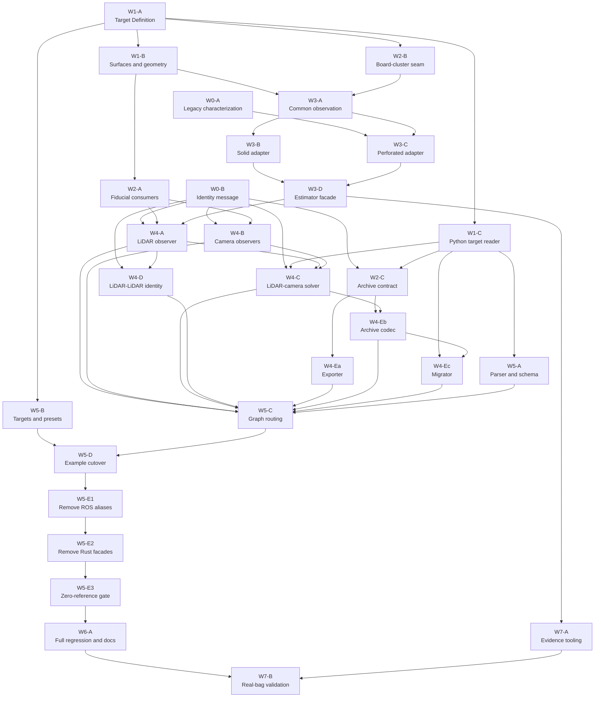

# Phase 8: Selectable Calibration Targets

- **Status:** Active implementation
- **Date:** 2026-08-27
- **Spec:** [Selectable calibration targets](../superpowers/specs/2026-08-21-selectable-calibration-targets.md)
- **Decision:** [ADR 0003](../adr/0003-selectable-calibration-targets.md)

## Current implementation state

Updated 2026-08-27. Packet status changes land here with each accepted review gate.

| Packet | State | Evidence / commit |
|---|---|---|
| W0-A | Complete | Legacy detector contract tests, `62f8c9d` |
| W0-B | Complete | Target Identity message, `9a4e6d7` |
| W1-A | Complete | Target Definition contract, `81abb0d` |
| W1-B | Complete | Canonical target geometry, `5aa1f73` |
| W1-C | Complete | Python target reader, `a5f6ce8` |
| W2-A | Complete | Target-derived fiducial patterns, `e6080b1` |
| W2-B | Complete | Neutral cluster evidence, `e21aa01` |
| W2-C | Complete | Archive identity contract, `77a1720` |
| W3-A | Complete | Neutral square/plane observation, `fd7411e` |
| W3-B | Complete | Solid evidence refinement and public-facade tests, `ea0eda4` |
| W3-C | Complete | Perforated ICP adapter and legacy characterization golden, `ea0eda4` |
| W3-D | Complete | Typed neutral estimator and temporary hollow facade, `ea0eda4` |
| W4-A | Complete | Selectable LiDAR observer, neutral estimator adapter, and hollow/solid regressions, `d6a37ca` |
| W4-B | Complete | Target-driven camera/generator adapters, `2ab0944`; binding cache fix, `dcb46e4` |
| W4-C | In progress | Implementation and final review complete; commit follows W4-D shared admission seam |
| W4-D | Complete | Atomic two-LiDAR identity gate and synchronized-pair admission; pending commit |
| W4-Ea | Complete | v4/v5 export parity, `82eb8a5` |
| W5-A | Complete | Selectable launch schema parser, `42a7934` |
| W5-B | Complete | Hollow/solid detector presets, `a0664db` |

W4-C/W4-D combined gate passed: final Terra audit clean, `just build` (17 ROS packages), `just test`
(317 Rust and 301 Python tests), `just lint-py`, deterministic cache/session race tests, and
`git diff --check`.

Active dependency path: W4-Eb archive runtime, then W4-Ec migration. W5-C still must route the new
`target_config`/`detector_config` fields; W4-C only added the identity routes required to keep the
maintained legacy graph functional while gates activate. W5-D through W6-A remain pending. W7
requires real rosbag evidence and is not headlessly closeable.

## Outcome

LCTK supports either the existing 1000 mm perforated target or the new 600 mm solid target. The
operator selects one Target Definition per sensor before launch. Physical geometry and fiducial
layout cross one deep Calibration Target interface; sensor-specific Detector Tuning stays separate.

This plan deliberately avoids a repository-wide flag day. New modules land beside temporary
compatibility facades, callers migrate in dependency order, and obsolete hollow-specific interfaces
are deleted only after the complete launch graph passes regression tests.

No phase may silently change transform direction, continuous-solver capture policy, hollow ICP
termination, or historical sample-data provenance.

## Delivery rules

1. One work packet is one bounded subagent assignment and normally one reviewable commit.
2. Every packet leaves its branch buildable and testable. Temporary compatibility is explicit,
   rejects conflicting old/new inputs, and has a named deletion packet.
3. One integrator owns the feature branch. Subagents edit only their assigned paths; the integrator
   handles shared manifests, lockfiles and final merges.
4. Parallel agents require disjoint primary ownership. Agents never perform simultaneous branch
   switches in the shared workspace; use sequential dispatch or separate worktrees.
5. Targeted tests run inside a packet. Every wave ends with `just build` and `just test`; Python
   waves also run `just lint-py`. The final headless gate runs `just lint`.
6. Builds use `just build`, never raw `cargo build` or `colcon build`. Interface-message changes
   follow CLAUDE.md's rosidl clean/regeneration procedure.
7. Real bags decide field performance. Synthetic data verifies algorithms and schemas only.

## Stable seams during migration

### Rust

Add `rust/calibration-target` before changing callers. Until cleanup,
`rust/hollow-board-config` is a compatibility facade for the legacy hollow constructors. Likewise,
the new `rust/calibration-target-detector` is introduced before the old detector crate disappears.
There is never a `hole_radius = 0` solid-board sentinel.

The target estimator's implemented external interface is:

```rust
let target = ValidatedTarget::parse_json5(bytes)?;
let estimator = TargetPoseEstimator::new(&target, tuning)?;
let observation = TargetSquarePlaneObservation::from_square_plane(&square_plane, sensor_up)?;
let outcome = estimator.estimate(observation, selected_points);
```

Surface dispatch, quarter-turn hypotheses, evidence ownership and `BoardIcpIterator` stay internal.
Tests and ROS callers cross the same interface.

This refines the spec's shorthand `estimate(points, sensor_up)`: W4-A's bbox and bbox-free
selectors own crop/background state and produce the same neutral square/plane evidence. Moving raw
cloud selection into the estimator would duplicate that stateful observer policy and make the two
selection modes diverge again.

### Python

The accepted `load_target(path) -> ValidatedTarget` interface has three callers: launch validation,
the LiDAR-camera solver/migrator, and archive tests. Put it in one ROS-free Python module rather than
copying canonicalization. Preferred home: a small `ros/lctk_target` ament-python package. During
migration, `lidar_to_camera_solver.board_geometry` may re-export legacy hollow helpers; it is deleted
in cleanup.

This is an implementation-level deepening of the spec's proposed solver-local
`target_geometry.py`: ownership moves to the shared domain module, but the accepted value interface
and semantics do not change.

### Runtime identity

Identity publishers may land before enforcement. Enforcement becomes active only when both observer
publishers, both solver subscribers and launch remaps are present. There is no permissive production
fallback after the activation packet.

### Configuration

Nodes may temporarily accept one legacy config parameter to keep old examples runnable. Supplying
both old and new parameters is an error. The compatibility path always means the explicit hollow
Target Definition; it cannot describe a second target. The launch cutover changes all maintained
examples atomically, after which cleanup removes the aliases.

## Dependency graph



## Work packets

### Wave 0 — Freeze behavior and create the wire type

#### W0-A — Characterize the legacy hollow path

**Owner:** Rust detector tests only.

**Scope:**

- pin current hollow surface projection and marker-corner goldens;
- pin `BoardIcpIterator` step/termination outputs without fixing M-21;
- add bbox and bbox-free characterization around the square-fit evidence currently discarded;
- record target-sized Detection3D/RViz behavior that is intentionally wrong today as assertions in
  new-target tests, not as a legacy golden.

**Primary files:**

- `rust/hollow-board-config/tests/`
- `rust/hollow-board-detector/tests/`
- `rust/board-cluster-detector/tests/`
- `fixtures/board/`

**Acceptance:** existing and added characterization tests remain green. Tests for interfaces that do
not exist yet wait for their owning packet. No production behavior changes.

#### W0-B — Add `CalibrationTargetIdentity.msg`

**Owner:** ROS interface package only. Parallel-safe with W0-A.

**Scope:** add the accepted five-field message and register it in rosidl.

**Primary files:** `ros/lctk_interfaces/msg/`, `CMakeLists.txt`, `package.xml` only if required.

**Acceptance:** regenerated Python and Rust bindings expose all fields; `just build` and `just test`.

### Wave 1 — Build the Calibration Target domain module

#### W1-A — Target Definition schema and semantic identity

**Depends on:** W0-A.

**Scope:**

- add `rust/calibration-target` beside the old crate;
- add strict schema parsing and field-specific validation;
- add explicit solid/perforated surface variants and LiDAR Orientation Reference;
- add the two accepted target manifests;
- implement canonical semantic bytes and SHA-256 identity;
- keep `hollow-board-config` compiling; no caller migration yet.

**Primary files:**

- `rust/calibration-target/`
- `ros/lctk_launch/config/targets/`
- target-schema fixtures under `fixtures/targets/`
- root `Cargo.toml`/`Cargo.lock` by integrator.

**Acceptance:** invalid-field table; equivalent units/comments/key order hash equally; every semantic
mutation changes the hash; cutout geometry and marker placement validate; targeted crate tests plus
wave `just build && just test`.

#### W1-B — Target geometry and surface adapters

**Depends on:** W1-A. **Parallel-safe with W1-C.**

**Scope:** move canonical axes/corners/paper mapping behind `ValidatedTarget`; implement solid plane
and perforated cutout closest-point adapters; preserve randomized diamond-frame and boundary
projection contracts.

**Critical rule:** do not reuse `board_cluster_detector::pose::BoardDetection` as the target pose.
Its `[forward,left,up]` axes differ from `corner_aligned_plate_center_v1`. Square/plane evidence stays
neutral until the target estimator constructs canonical axes.

**Acceptance:** property tests for both surfaces; hollow golden unchanged; explicit cutout validation;
deleting the new module would force geometry logic back into multiple callers.

#### W1-C — Shared Python Target Definition reader

**Depends on:** W1-A. **Parallel-safe with W1-B.**

**Scope:** implement the same immutable value interface, validation, marker expansion, canonical
bytes and identity in one ROS-free Python package. Consume the same target manifests and goldens.

**Primary files:** new `ros/lctk_target/`, Python geometry/identity fixtures, package registration.

**Acceptance:** Rust/Python canonical bytes, hashes and marker corners match for both targets; exact
solid marker side is 480 mm; 1x1 and 2x2 layouts pass; malformed/duplicate IDs fail; `just lint-py`.

### Wave 2 — Open independent consumer seams

These three packets can run in parallel after their dependencies. They must not edit each other's
primary files.

#### W2-A — Generalize fiducial detection and generation

**Depends on:** W1-A and W1-B.

**Scope:**

- keep low-level dictionary/rendering types in `aruco-config`;
- derive physical pattern and paper placement from a Target Definition;
- add exact 1x1/ID 1 detector and generator tests;
- preserve 2x2 hollow behavior and OpenCV corner ordering.

**Primary files:** `rust/aruco-config`, `aruco-detector`, `aruco-locator`, `aruco-generator`.

**Acceptance:** generated solid image is 600 mm logical paper with 60 mm white margin and 480 mm
marker; detector accepts exactly ID 1 for that profile; hollow renderer golden remains stable.

#### W2-B — Inject target size into board clustering

**Depends on:** W1-A and W0-A.

**Scope:** add the target-side detection interface and return the raw `SquareFit`/plane observation
instead of discarding it. Keep a deprecated compatibility adapter that reads serialized `side_m` for
unmigrated callers; it delegates immediately to the new interface. W5-E2 removes `side_m` and the
adapter after every caller has moved. Absorb L-17's duplicated geometry/default ownership without
changing unrelated tuning defaults.

**Primary files:** `rust/board-cluster-detector/src/{config,detector,square_fit,pose}.rs` and tests.

**Acceptance:** 0.6 m and 1.0 m fixtures; existing real-fixture decision parity; no target-frame axis
construction inside this module.

#### W2-C — Define the shared archive contract

**Depends on:** W1-C and W0-B.

**Scope:** add paired v4/v5 solved fixtures and pure validators. Keep distinct rules:

- v5 is restorable only with exact local Target Identity;
- v4 is transform-exportable but not restorable;
- v3-to-v4 migration always stamps literal version 4, even after the current format becomes 5.

**Primary files:** `fixtures/detection_archives/` and narrow validator tests in solver/exporter.

**Acceptance:** malformed identity table; 64-character lowercase hash validation; paired v4/v5
fixtures carry identical solved transforms; `just test`.

### Wave 3 — Implement the target pose estimator

#### W3-A — Common square-and-plane observation

**Depends on:** W1-B and W2-B.

**Scope:** construct neutral square/plane evidence, four board-up candidates and alignment scores.
The common result is an observation, not a final Calibration Target pose.

**Acceptance:** normal-sign, center and corner-order tests; dot examples `1.0`, `0.924`, `0.866`,
`0.707`; bbox and bbox-free paths produce identical observation semantics.

#### W3-B — Solid adapter

**Depends on:** W3-A. **Parallel-safe with W3-C only under the ownership below.**

**Scope:** implement evidence-separated refinement: square edges own in-plane translation/yaw;
plane owns normal translation/tilt; selected quadrant never changes; final alignment is at least
0.90; insufficient edge evidence rejects. No `BoardIcpIterator` toggle.

**Primary ownership:** `calibration-target-detector/src/solid.rs` and solid-only tests. The
integrator owns shared `lib.rs`, result types and manifests.

**Acceptance:** exact/noisy/outlier synthetic scenes; interior-only data cannot invent in-plane
pose; 22.5 degrees passes and 30 degrees rejects; covariance/diagnostics expose weak directions.

#### W3-C — Preserve ICP and implement the perforated adapter

**Depends on:** W1-B, W3-A and W0-A. **Parallel-safe with W3-B only under the ownership below.**

**Scope:** migrate `BoardIcpIterator` to explicit perforated surfaces without altering termination;
score four quarter-turn hypotheses using cutouts; require best/second-best separation; common
estimator may seed/gate/diagnose but never becomes hollow final authority.

**Primary ownership:** `calibration-target-detector/src/perforated.rs`, the migrated internal ICP
module and perforated-only tests. The integrator owns shared `lib.rs`, result types and manifests.

**Acceptance:** current ICP characterization stays within tolerance; correct quadrant wins;
symmetric/weak evidence rejects; no silent common-estimator fallback. M-21 remains separate.

#### W3-D — Publish the deep estimator interface

**Depends on:** W3-B and W3-C.

**Scope:** add `TargetPoseEstimator`, `TargetDetection` and structured rejection/diagnostic results;
hide surface dispatch and move reusable tuning out of physical geometry. Add temporary
`hollow-board-detector` facade so current ROS callers still compile.

**Acceptance:** the same interface exercises both adapters; no caller-visible surface-specific
estimator class; all Rust tests plus wave `just build && just test && just lint`.

### Wave 4 — Migrate observers, solvers and archives

After Wave 3, observer publishers and independent archive work can begin in parallel. Solver identity
activation waits for the required publishers as encoded below. Each packet may add a temporary
compatibility parameter, but must reject simultaneous legacy/new parameters.

#### W4-A — LiDAR observer adapter

**Depends on:** W0-B, W2-A and W3-D.

**Scope:** load `target_config` and Detector Tuning separately; call only the estimator interface;
publish relative transient-local `target_identity`; size Detection3D/RViz geometry from the target;
hide hollow-only ICP diagnostics and cutout markers for solid; preserve stable detection topics.

**Primary files:** `ros/lidar_board_detector/`.

**Acceptance:** hollow sample regression; synthetic solid output has 0.6 m plate, no cutout markers,
structured rejects and correct identity; both bbox modes share pose semantics.

#### W4-B — Camera observer and generator adapters

**Depends on:** W0-B and W2-A. **Parallel-safe with W4-A.**

**Scope:** make locator/generator consume `target_config`; remove the fixed four-ID warning; publish
camera `target_identity`; render the exact target fiducial.

**Primary files:** `ros/aruco_locator_node/`, `ros/aruco_generator_node/` and their Rust library
adapters only.

**Acceptance:** one-marker image detection, four-marker regression, late subscriber receives
identity, generated artifact matches target manifest.

#### W4-C — LiDAR-camera generic target geometry and identity gate

**Depends on:** W0-B, W1-C, W4-A and W4-B.

**Scope:** replace solver-local duplicated geometry with `lctk_target`; wait for LiDAR identity,
camera identity and local identity; accept no Detection Pair before exact equality; retain continuous
one-Capture and manual behavior unchanged.

**Primary files:** `ros/lidar_to_camera_solver/{main.py,board_geometry.py,tests}` and package deps.

**Acceptance:** missing/malformed/mismatch decision table; late-join success; buffer stays empty
before identity agreement; ID 1 yields four usable correspondences; continuous result remains
publishable/savable/exportable.

#### W4-D — LiDAR-LiDAR identity gate

**Depends on:** W0-B and W4-A.

**Scope:** compare both LiDAR identities before pair acceptance. Do not alter H-13's latest-pair
solve policy or transform direction.

**Primary files:** `ros/lidar_to_lidar_solver/` only.

**Acceptance:** add pure comparator and ROS tests for missing, malformed, mismatch, match and restart;
every failure occurs before buffer mutation; package declares `lctk_interfaces`; M-16 field
validation remains later.

#### W4-Ea — Autoware exporter v4/v5 compatibility

**Depends on:** W2-C. **Parallel-safe with W4-A/W4-B.**

Accept structurally valid v5 and valid v4; reject v1-v3, future versions and malformed identity;
prove paired v4/v5 fixtures export identical six values and xacro transforms. Own only
`ros/lctk_autoware_export/` and shared fixtures through the integrator.

#### W4-Eb — Detection Archive v5 codec/runtime

**Depends on:** W2-C and W4-C. This serializes after W4-C because both touch solver runtime/tests.

Require local identity in the encoder; check exact identity before pair decoding or buffer mutation;
preserve covariance, quality and adjusted transform; reject v4 restore with a migration command.

#### W4-Ec — Explicit v4-to-v5 migration

**Depends on:** W4-Eb and W1-C.

Retain v3-to-v4 with a literal version-4 output; add v4-to-v5 `--target-config`; validate observed
marker IDs; copy all other fields unchanged and state that provenance is operator-asserted.

**Wave acceptance:** atomic mismatch rejection; v4 direct export remains green; paired xacro e2e;
source archive contents deep-equal after removing the added identity/version fields;
`just build && just test && just lint-py`.

### Wave 5 — Activate the new launch/config contract

#### W5-A — Launch parser/schema with compatibility

**Depends on:** W1-C.

Add `target_config`, `detector_config`, `bbox_config` and `aruco_detector_config`; compare canonical
Target Identity rather than paths; reject different identities assigned to one sensor. Continue to
parse maintained legacy examples through one explicit hollow translation until W5-D. Own
`config_parser.py` and parser tests only.

**Acceptance:** semantically identical differently formatted targets are allowed; conflicts reject;
legacy and new schema fixtures both parse without starting ROS.

#### W5-B — Target and Detector Tuning files

**Depends on:** W1-A. **Parallel-safe with W5-A.**

Add target manifests to installed config, split hollow/solid sensor presets, and remove physical
geometry from new Detector Tuning files. Do not switch maintained examples yet. Own `config/targets/`
and new preset directories only.

#### W5-C — Generated graph and identity routing

**Depends on:** W4-A, W4-B, W4-C, W4-D, W4-Ea, W4-Eb, W4-Ec and W5-A.

Pass the new node parameters and route exact relative identity publishers to solver inputs. Own
planner dataclasses, `calibrate.launch.py`, `demo.launch.py` and graph tests. No example-file edits.

**Acceptance:** generated graph contains one locator per camera, one selected target per sensor and
the exact identity remaps; all legacy-schema tests still use the compatibility path.

#### W5-D — Maintained-example cutover

**Depends on:** W5-B and W5-C.

Atomically switch all maintained examples to the new schema. Existing recordings explicitly select
the hollow target; add one solid example with experimental presets. After this packet, no maintained
launch depends on compatibility parameters.

**Acceptance:** every example parses and generates a coherent graph; old recordings remain hollow;
`just build && just test && just lint-py`.

#### W5-E1 — Remove ROS/config compatibility aliases

**Depends on:** W5-D.

Delete legacy parameters from maintained LiDAR, camera and solver nodes; delete the standalone
physical ArUco config and old Detector Tuning files; remove parser compatibility translation. Do not
touch Rust facade crates or rename directories in this packet. Do not port the superseded
`extrinsic_solver_node`.

**Acceptance:** all maintained examples use only new parameters; old-schema parser fixtures now
reject with migration guidance; `just build && just test && just lint-py`.

#### W5-E2 — Remove Rust facades and finish neutral renames

**Depends on:** W5-E1. **Integrator-led because Cargo paths, package dependencies and the lockfile
move together.**

Remove `hollow-board-config` and `hollow-board-detector` facades; finish neutral crate/directory
names; remove the board-cluster `side_m` adapter; switch remaining Cargo/package dependencies; update
the root lockfile once. Preserve `BoardIcpIterator` inside the perforated adapter.

**Acceptance:** every Rust/ROS caller compiles through the neutral interfaces; hollow regression
tests now live under neutral crates; `just build && just test && just lint`.

#### W5-E3 — Zero-reference integration gate

**Depends on:** W5-E2. **Integrator-owned verification packet.**

Search current production code/config/docs for removed crate names, parameters and physical-geometry
duplication. Archived history may retain old terminology. Repair package manifests and current-doc
links only; no estimator behavior change.

**Acceptance:** zero unintended references, clean relative links, `git diff --check`, and repeat the
Wave 5 full build/test/lint gate.

### Wave 6 — Regression, documentation and issue reconciliation

#### W6-A — Full headless release gate

**Depends on:** W5-E3.

**Scope:**

- run shared Rust/Python target goldens;
- run both target interfaces through bbox/bbox-free detector tests;
- run hollow sample regressions and launch graph tests;
- run v4/v5 archive/export xacro e2e;
- update CLAUDE.md, package READMEs and book workflow/migration pages;
- reconcile overlapping issues only when their exact acceptance evidence exists.

**Commands:** `just build`, `just test`, `just lint-py`, `just lint`, `git diff --check`, and the docs
relative-link checker. Record results in this phase document.

**Not headlessly closeable:** M-16 and solid-preset validation. H-12/H-13 and M-21 are adjacent but
out of scope. M-01 transform direction remains owned by its existing in-progress work.

### Wave 7 — Real-data tuning and validation

#### W7-A — Deterministic evidence collector and report schema

**May begin earlier:** schema/label tooling can run in parallel; production-output collection waits
for stable Wave 4 diagnostics.

**Scope:**

- define a sidecar manifest containing bag checksum, target identity, sensor/preset, topic map and
  labelled visible/absent/stationary intervals;
- replay/extract deterministic timestamps, accept/reject reasons, poses/covariance, alignment dot,
  quadrant, ArUco observations, solver outputs and sampled overlays;
- write a versioned evidence report with denominators and artifact index;
- keep bags/results caches untracked; commit labels and summarized reports only.

**Acceptance:** repeated extraction of the same bag/config yields the same timestamp set and counts;
accepted frames have identity and pose; rejected frames have a structured reason; synthetic fixtures
are visibly marked test-only.

#### W7-B — Tune and evaluate each solid preset

**Depends on:** W6-A and W7-A. **Requires real bags/operator.**

Run separately for Velodyne-solid and Seyond-solid:

- moving bags: labelled detection coverage, camera-checked quadrant continuity, overlays and
  independent non-overlapping time-window/subset extrinsic consistency;
- short supplemental static interval: translation/rotation jitter;
- short board-absent/clutter interval: false detections.

Historical hollow bags are reference/regression data, not a raw A/B threshold baseline. Handheld
motion is never reported as estimator jitter. A temporal jump alone does not prove a quadrant flip;
confirm against synchronized ArUco orientation in a common frame.

Each preset stays experimental until its evidence report receives operator/maintainer sign-off. Any
confirmed quadrant flip blocks promotion. Other metrics are reported without invented universal
thresholds. Promotion is a small separate config/docs commit per preset.

## Parallel-dispatch matrix

| After | Parallel assignments | Must serialize |
|---|---|---|
| W0 | W0-A tests; W0-B message | rosidl lockfile regeneration |
| W1-A | W1-B Rust geometry; W1-C Python target | shared golden changes by integrator |
| W1 | W2-A fiducials; W2-B clustering; W2-C archives | root lockfile |
| W3-A | W3-B solid; W3-C perforated | estimator facade W3-D |
| W3-D | W4-A LiDAR; W4-B camera; W4-Ea exporter | W4-C after both observers; W4-D after LiDAR |
| W4 publishers | W5-A parser; W5-B presets | W4-Eb after W4-C; W4-Ec after codec |
| W4 complete | W5-C graph routing | W5-D example cutover, then W5-E1 aliases |
| W5-E1 | — | W5-E2 Rust renames, then W5-E3 integration gate |
| W5-E3 | docs, goldens, issue evidence | final full gates |
| Stable diagnostics | W7-A evidence tooling | preset promotion after real reports |

## Subagent handoff template

Every dispatched packet receives:

```text
Implement packet <ID> from docs/roadmap/phase-8-selectable-calibration-targets.md.
Read CLAUDE.md, the accepted spec, ADR 0003, and the packet's dependencies.
Edit only <owned paths>. Preserve unrelated/user changes.
Do not broaden into listed adjacent issues.
Run <targeted tests>. Report changed files, interface impact, evidence, and remaining blockers.
Do not mark the packet complete if its acceptance contract is unmet.
```

Use an investigator for locating exact sites, a builder only for a surgical one- or two-file packet,
and a reviewer after every merge. Cross-cutting packets W1-A, W3-D, W5-C, W5-E2, W5-E3 and W6-A
stay integrator-led.

## Issue coordination

- **M-14 (in progress):** direct overlap with W1/W3/W4. Do not start overlapping edits until its
  current owner coordinates; this phase should supply shared corner goldens and both orientation
  adapters.
- **M-17:** W0-A characterizes both paths; W3/W4 intentionally establish the new shared semantics.
- **M-19:** use validation errors and ordinary tests, never release-disabled `debug_assert!`; do not
  mix a workspace-profile fix into this phase.
- **M-21:** preserve `BoardIcpIterator` termination behavior during migration; fix separately.
- **L-17:** W2-B absorbs geometry/default ownership; no concurrent `config.rs` edit.
- **L-19:** resolved only after W5-E1 removes the unused standalone LiDAR ArUco parameter.
- **H-11:** W1-C/W4-C provide the shared diamond-frame geometry; close only with its camera-side
  evidence.
- **H-12/H-13:** solver acquisition policies remain unchanged.
- **M-01 (in progress):** W4-Ea must rebase around its owner and must not alter transform algebra.
- **M-16:** remains operator/field work in W7.

## Completion definition

Phase 8 headless implementation is complete when W6-A passes and every maintained example explicitly
selects one coherent Target Definition. This does not imply either solid preset is validated.

The complete feature is field-ready when W7-A can produce reproducible evidence reports. Each solid
sensor preset becomes validated independently only through W7-B sign-off. The hollow target and
`BoardIcpIterator` remain supported after completion.
