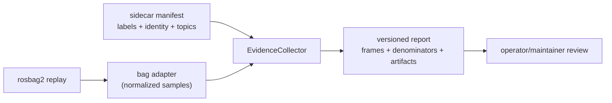

# W7-A: deterministic calibration evidence tooling

Status: implementation packet, schema version 1.

This packet adds a ROS-free evidence core to `lctk_quality`. It records what a
real-bag replay observed without inventing field thresholds or treating synthetic
clouds as field evidence. A bag-specific adapter may later translate ROS messages
into the normalized sample boundary.

## Boundary



`EvidenceCollector` does not import `rclpy`, `rosbag2_py`, or ROS message types.
That keeps interval selection, identity checking, ordering, and serialization
testable on this machine. The adapter boundary is explicit because the current
detector diagnostics are ROS-node-specific and are still changing across the
single-source-target migration; a future adapter must name every mapping it makes.

## Sidecar manifest

`EvidenceManifest` is the commit-friendly label file. Its canonical JSON fields
are:

```json
{
  "schema_version": 1,
  "bag": {
    "sha256": "<64 hex characters>",
    "size_bytes": 1234,
    "storage_id": "sqlite3",
    "relative_path": "bags/solid.db3"
  },
  "target_identity": {
    "schema_version": 1,
    "target_id": "solid_600_aruco_1",
    "revision": 1,
    "semantic_sha256": "<target identity digest>",
    "board_frame_convention": "corner_aligned_plate_center_v1"
  },
  "sensor": "velodyne_top",
  "preset": "solid_600/velodyne",
  "topics": {
    "aruco_detection": "/camera/aruco_detections",
    "board_detection": "/sensing/lidar/top/calibration_board_detections",
    "overlay": "/camera/image_with_detections",
    "pointcloud": "/sensing/lidar/top/points_raw",
    "solver_status": "/calibration/get_buffer_status",
    "target_identity": "/sensing/lidar/top/target_identity"
  },
  "intervals": [
    {"label": "visible", "start_ns": 1000000000, "end_ns": 2000000000, "name": "moving"},
    {"label": "stationary", "start_ns": 1300000000, "end_ns": 1500000000, "name": "hold"},
    {"label": "absent", "start_ns": 2500000000, "end_ns": 3000000000, "name": "clutter"}
  ],
  "provenance": "field"
}
```

Intervals are half-open (`start_ns <= timestamp < end_ns`) and may overlap. A
stationary interval is normally a subset of visible; it is counted independently
so stationary pose spread cannot be confused with moving-board coverage. `field`
is for real recordings. Test fixtures must set `provenance` to `test_only`, which
also appears as `summary.synthetic_test_only` in the report.

`bag.relative_path` is optional metadata and must be relative. The bag checksum is
the content binding; absolute machine paths are intentionally not accepted. Topic
roles are explicit rather than inferred from names.

## Normalized sample and report

Each normalized input JSON-lines record is one timestamp. A timestamp must be
unique after the adapter has merged all relevant topics. Accepted records require
the exact manifest identity and a pose. Rejected records require a structured
`rejection` object (`code`, optional `detail`, and typed `evidence`). Optional
fields preserve the target-facing evidence needed by W7-B:

- board pose and 36-value covariance;
- alignment dot product and selected quadrant;
- ArUco marker IDs, four ordered corners, and score;
- solver output values;
- IDs of sampled overlay/trace/result artifacts.

The report stores the sorted selected timestamp set and the corresponding frame
records. It contains one denominator triple per label:

```text
denominators[label] = {
  frames: all selected timestamps in that interval,
  accepted: accepted detections,
  rejected: structured rejections
}
```

The absent `accepted` count is the observable false-detection count. The visible
`accepted` count is the coverage numerator. Stationary accepted frames provide the
input set for later jitter analysis; this packet does not manufacture a jitter
threshold. `summary` repeats basic counts, pose/covariance/alignment availability,
quadrant counts, and test-only provenance for quick review.

Artifacts are an index of relative paths, optional checksums, kind, and timestamp.
Large bags, caches, generated overlays, and solver result files stay untracked;
the report only commits their stable references and checksums.

## Determinism contract

`EvidenceCollector.collect` sorts by integer nanoseconds, rejects duplicates,
applies fixed label order (`visible`, `absent`, `stationary`), sorts topic/interval
and artifact output, and serializes canonical JSON with sorted keys and no NaN or
infinity. Replaying the same normalized input and manifest therefore produces the
same selected timestamps, counts, and report bytes. No wall-clock time, filesystem
ordering, random sampling, or detector threshold is used.

The JSON-lines reader is a headless fixture/adapter contract, not a rosbag reader.
Adding ROS extraction requires a separate packet that documents the exact topic and
message-field mapping and verifies it against real bags; until then, no production
evidence is fabricated.
