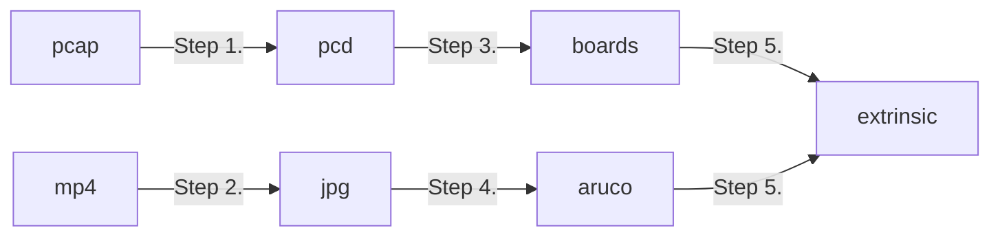

# LiDAR to Camera Cablibration

## Data Recording

Please follow the steps [here](../record-data/README.md). Assume that the collected data is placed like below

```bash
recording/{N}/{T}/wayside{W}/video/camera{C}.mp4
recording/{N}/{T}/wayside{W}/video/camera{C}.txt
recording/{N}/{T}/wayside{W}/pcd/lidar1.pcap
```

where
```bash
N = name of the recipe, e.g. lidar-to-camera-1-3
T = sample timestamp in RFC3339 from host
W = wayside sensor index: 1~3
C = camera index: 1~3
```

## Solve LiDAR-to-camera extrinsic

Assume all the calibration outputs will be placed under the directory _calibration_.

Workflow overview



### Step 1. pcap -> [pcd]

Partition Point cloud data (PCD) from the raw pcap file into frames.
Usually, 3~5 frames is enough for the calibration.

Input:

```bash
recording/{N}/{T}/wayside{W}/pcd/lidar1.pcap
```

Output:

```bash
calibration/{N}/{T}/wayside{W}/pcd/{F}.pcd
```

Script:

```bash
cargo run
    --release \
    --manifest-path "../../rust-bin/pcd-tool/Cargo.toml" \
    -- \
    convert \
    "recording/{N}/{T}/wayside{W}/pcd/lidar1.pcap" \
    "calibration/{N}/{T}/wayside{W}/pcd/{F}.pcd" \
    10 \
    3
```

#### TODO
>
> 1. Improve the utility to
> ```bash
> cargo run
>     --release \
>     --manifest-path "../../rust-bin/pcd-tool/Cargo.toml" \
>     -- \
>     convert \
>     --input "recording/{N}/{T}/wayside{W}/pcd/lidar1.pcap" \
>     --output "calibration/{N}/{T}/wayside{W}/pcd/{F}.pcd" \
>     --start-number 10 \
>     --number-of-frame 3
> ```
> 2. Write a script to run it more conveniently.
>
> For instance, running the command below and the remaining arguments are generated by default.
>
> ```bash
> ./01_convert-to-pcd.sh  "recording/{N}/{T}/wayside{W}"
> ```
>  Or process multiple calibration samples at once, e.g.
> ```bash
> for sample_dir in recording/{N}/**/wayside{W}; do ./01_convert-to-pcd.sh $sample_dir; done
> ```


### Step 2. mp4 -> [jpg]

In this step, we partition the video file into several frames.

Input:

```
recording/{N}/{T}/wayside{W}/video/camera{C}.mp4
```

Output:

```bash
calibration/{N}/{T}/wayside{W}/img/{F}.jpg
```

where

```bash
F = frame index
```

Script:

```bash
rm -rf "calibration/{N}/{T}/wayside{W}/img"
mkdir -p "calibration/{N}/{T}/wayside{W}/img"
ffmpeg -i "recording/{N}/{T}/wayside{W}/video/camera{C}.mp4" "calibration/{N}/{T}/wayside{W}/img/%05d.jpg"
```

#### TODO

> 1. Write a script to run it more conveniently.
>
> For instance, running the command below and the remaining arguments are generated by default.
>
> ```bash
> ./02_convert-to-image.sh  "recording/{N}/{T}/wayside{W}"
> ```
>  Or process multiple calibration samples at once, e.g.
> ```bash
> for sample_dir in recording/{N}/**/wayside{W}; do ./02_convert-to-image.sh $sample_dir; done
> ```

### Step 3. pcd -> boards

Detect the board based on the pcd information.

Input:

```
calibration/{N}/{T}/wayside{W}/pcd/{F}.pcd
```
```bash
F = frame index
```

Output:

```
calibration/{N}/{T}/wayside{W}/boards/{F}.json5
calibration/{N}/{T}/wayside{W}/bbox.json5
```

#### TODO

> 1. Modify the script ../../scripts/lidar-to-camera-calibration/03_detect-board.sh.
> 2. Process multiple samples at once: calibration/{N}/**/wayside{W}/pcd/{F}.pcd


### Step 4. img -> aruco

Detect the board based on the image information.

Input:

```bash
calibration/{N}/{T}/wayside{W}/img/{F}.jpg
```
```bash
F = frame index
```

Output:

```bash
calibration/{N}/{T}/wayside{W}/aruco/{F}.json5
```

#### TODO

> 1. Modify the script ../../scripts/lidar-to-camera-calibration/04_detect-aruco.sh
> 2. Process multiple samples at once: calibration/{N}/{T}/wayside{W}/img/{F}.jpg

### Step 5. Compute extrinsic

Input:

```bash
calibration/{N}/{T}/wayside{W}/boards/{F}.json5
calibration/{N}/{T}/wayside{W}/aruco/{F}.json5
```

Output:

```bash
calibration/{N}/extrinsic.json5
```

#### TODO

> 1. Merge the scripts ../../scripts/lidar-to-camera-calibration/05_solve-extrinsics.sh and ../../scripts/lidar-to-camera-calibration/06_project-points.sh into one script.
> 2. Process multiple samples at once


```bash
calibration/{N}/{T}/img/{F}.jpg
calibration/{N}/{T}/aruco/{F}.json5
calibration/{N}/{T}/pcd/{F}.pcd
calibration/{N}/{T}/boards/{F}.json5
calibration/{N}/{T}/bbox.json5
```

```bash
calibration/{N}/extrinsic.json5
```
