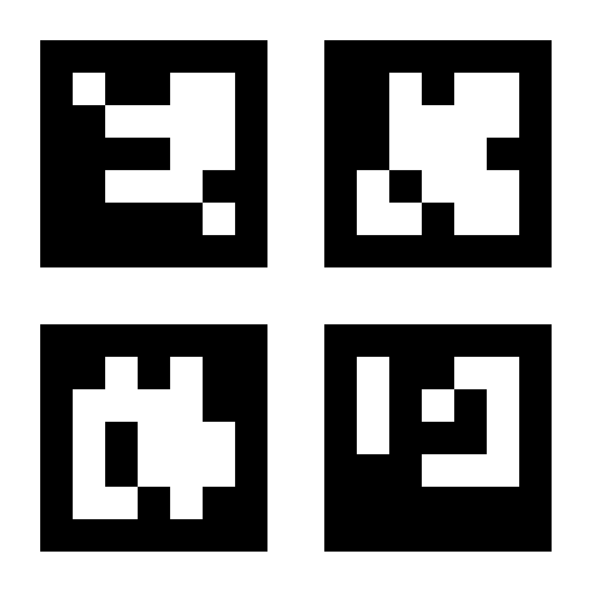

# ArUco Generator

An interactive command-line program to generate ArUco markers.

## Usage

This program goes through a series questions to ask for user
preferences. This example generates a marker image with these options.

```
What is the kind of marker?: multiple ArUcos
Which dictionary to use?: DICT_5X5_1000
How many squares per side?: 2
Board size (millimeters)?: 500
Board border size (millimeters)?: 10
Marker size to square size ratio?: 0.8
Border bits?: 1
Pixels per inch (dpi)?: 300
Generate random marker IDs? yes
149,391,385,482
save to?: DICT_5X5_1000-2x2-500-10-0.8-149,391,385,482.jpg
square size = 240 mm
marker size = 192 mm
```

This produces an image file named in `D-NxN-S-B-R-I.jpg` format.

- `D`: Dictionary name
- `NxN`: The dimension of ArUco markers. 2x2 gives 4 markers, 2 on
  each side.
- `S`: The board size in millimeters.
- `B`: The border width in millimeters.
- `R`: The scale of the marker size. R=0.8 will scale down the marker
  image size by the factor of 0.8.
- `I`: The comma-separated list of IDs used in this image.


For example. the image file
`DICT_5X5_1000-2x2-500-10-0.8-149,391,385,482.jpg` is shown below.


