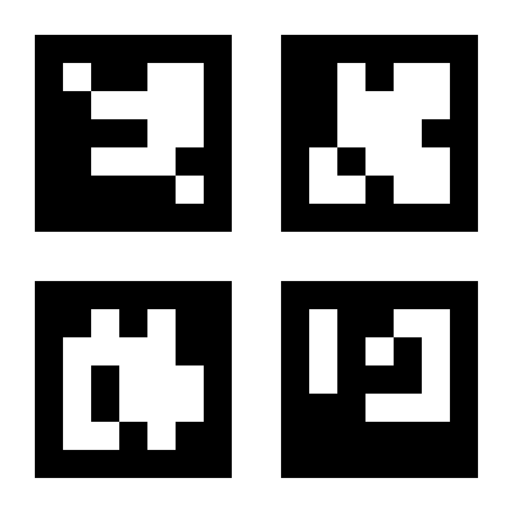

# ArUco Generator

A tool for generating ArUco markers and ChArUco boards for computer vision applications.

## Usage

The aruco-generator supports three modes of operation:

### 1. Interactive Mode (Default)

Run the program without any arguments to use the interactive mode:

```bash
cargo run --bin aruco-generator
```

This will prompt you with questions to configure the marker generation interactively.

Example interactive session:
```
What is the kind of marker?: multiple ArUcos
Which dictionary to use?: DICT_5X5_1000
How many squares per side?: 2
Board size (millimeters)?: 500
Board border size (millimeters)?: 10
Marker size to square size ratio?: 0.8
Border bits?: 1
Pixels per inch (dpi)?: 300
Generate random marker IDs? yes
149,391,385,482
save to?: DICT_5X5_1000-2x2-500-10-0.8-149,391,385,482.jpg
square size = 240 mm
marker size = 192 mm
```

### 2. Configuration File Mode

Generate markers using a TOML configuration file:

```bash
# Use the configuration file
cargo run --bin aruco-generator -- --config example.toml

# Override preview setting
cargo run --bin aruco-generator -- --config example.toml --preview
```

## Configuration File Format

The configuration file uses TOML format. Here's an example for multiple ArUco markers:

```toml
marker_kind = "multiple_arucos"
preview = true

[multiple_arucos]
dictionary = "Dict5X51000"
num_squares_per_side = 2
board_size_mm = 500.0
board_border_size_mm = 10.0
marker_square_size_ratio = 0.8
border_bits = 1
dpi = 300.0

# Use random marker IDs
[multiple_arucos.marker_ids]
type = "random"

# Or use specific marker IDs:
# [multiple_arucos.marker_ids]
# type = "specific"
# ids = [149, 391, 385, 482]
```

## Marker Types

### 1. Single ArUco Marker

```toml
marker_kind = "single_aruco"

[single_aruco]
dictionary = "Dict5X51000"
output_path = "single_aruco.jpg"
```

### 2. Single ChArUco Board

```toml
marker_kind = "single_charuco"

[single_charuco]
dictionary = "Dict5X51000"
squares_per_side = 2
border_bits = 1
marker_to_square_length_ratio = 0.8
paper_size_mm = 500.0
margin_size_mm = 50.0
dpi = 300.0
output_path = "charuco_board.jpg"
```

### 3. Multiple ArUco Markers

```toml
marker_kind = "multiple_arucos"

[multiple_arucos]
dictionary = "Dict5X51000"
num_squares_per_side = 2
board_size_mm = 500.0
board_border_size_mm = 10.0
marker_square_size_ratio = 0.8
border_bits = 1
dpi = 300.0

# Marker ID configuration
[multiple_arucos.marker_ids]
type = "random"  # or "specific"
# For specific IDs:
# ids = [149, 391, 385, 482]
```

## Available Dictionaries

The following ArUco dictionaries are available:

- `Dict4X41000`
- `Dict5X51000`
- `Dict6X61000`
- `Dict7X71000`
- `DictApriltag16H5`
- `DictApriltag25H9`
- `DictApriltag36H10` 
- `DictApriltag36H11`
- `DictAruco`

## File Naming Convention

The generated files follow the naming pattern `D-NxN-S-B-R-I.jpg`:

- `D`: Dictionary name
- `NxN`: The dimension of ArUco markers. 2x2 gives 4 markers, 2 on each side.
- `S`: The board size in millimeters.
- `B`: The border width in millimeters.
- `R`: The scale of the marker size. R=0.8 will scale down the marker image size by the factor of 0.8.
- `I`: The comma-separated list of IDs used in this image.

For example: `DICT_5X5_1000-2x2-500-10-0.8-149,391,385,482.jpg`


